# 产品亮点

## 易有云功能预览

### 手机（iOS & Android)

**1.首页智能分类**

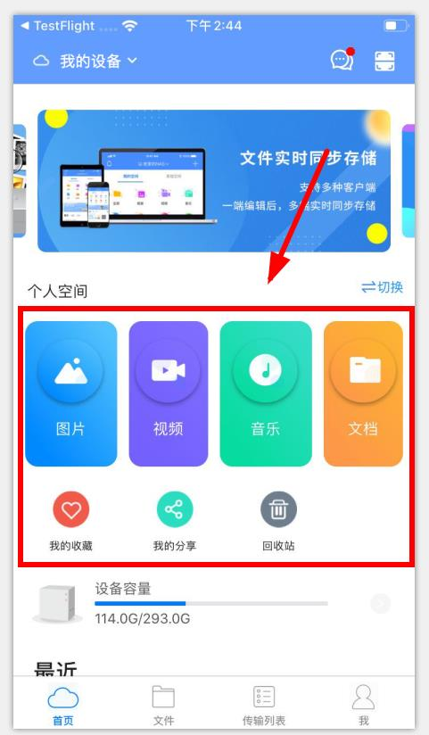

**2.首页切换设备**

*Android支持切换至手机终端

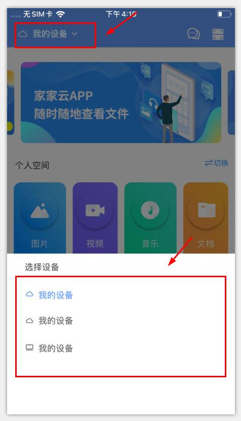

**3.文件上传**

*一键备份：为一次性即时上传手机所有文件数据

**4.文件管理操作**

**5.压缩包在线解压**

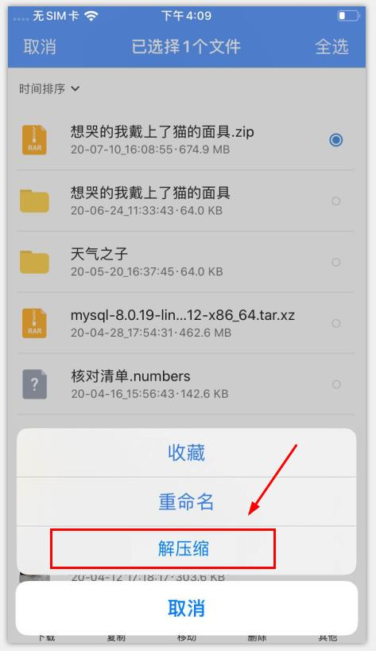

**6.多文件在线压缩**

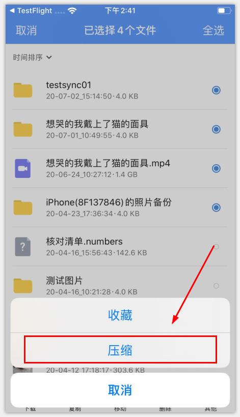

**7.跨设备传输**

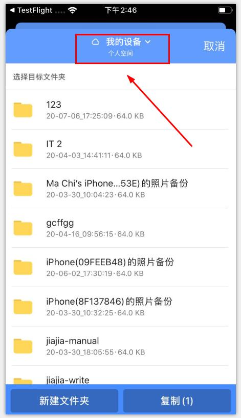

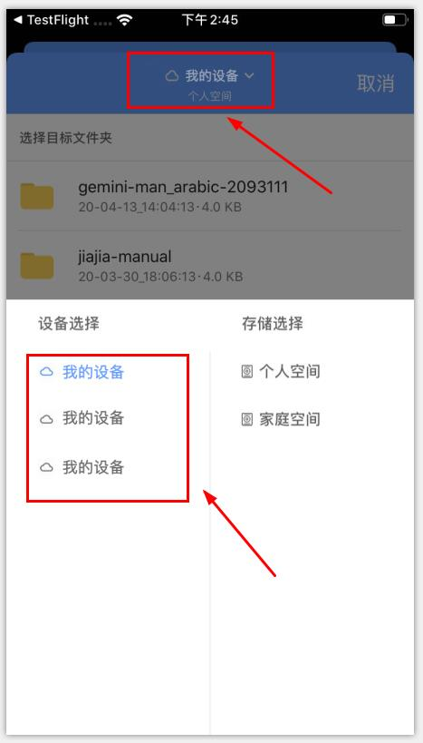

**8.视频倍速播放**

**9.视频外挂字幕**

**10.多人共享设备**

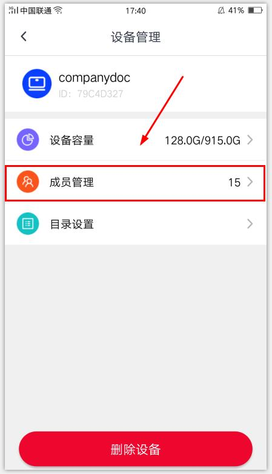

**11.自动备份（iOS）**

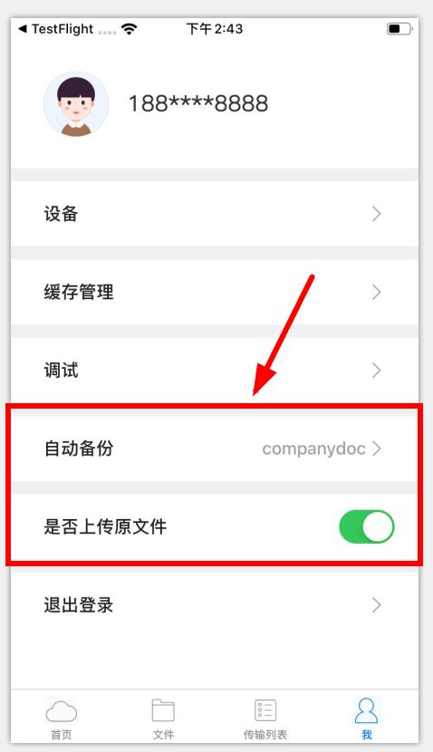

**12.微信文件直接上传至易有云设备（iOS）**

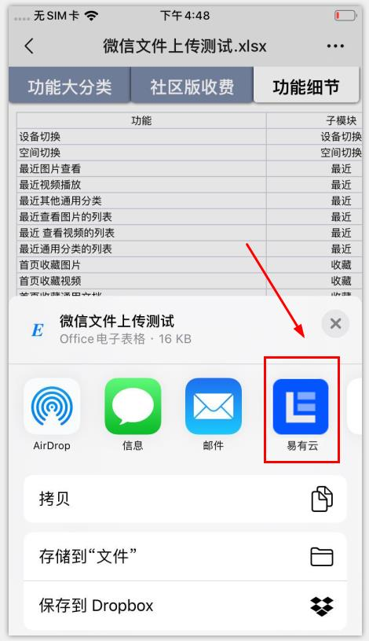

**13.可切换至本机终端，管理本机文件，实现终端与设备间文件互转（Android）**

### PC (MacOS & Windows)

**1.首页智能分类**

**2.可切换至本机终端，管理本机文件，实现终端与设备间文件互转**

**3.终端与设备文件同步，可设置单向/双向同步**

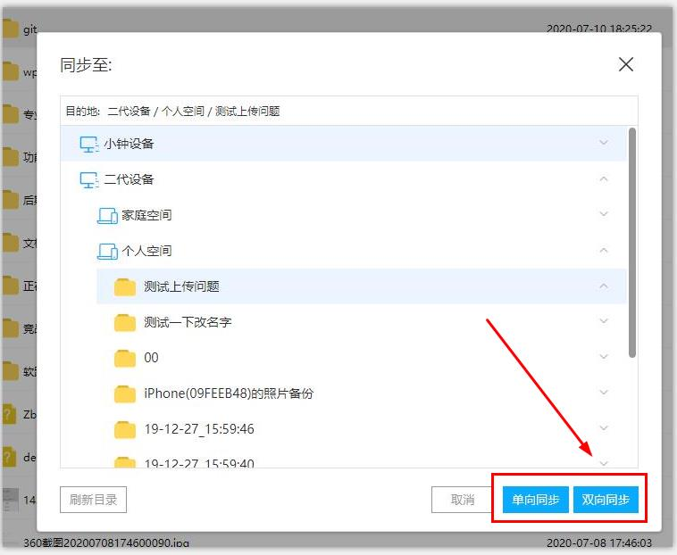

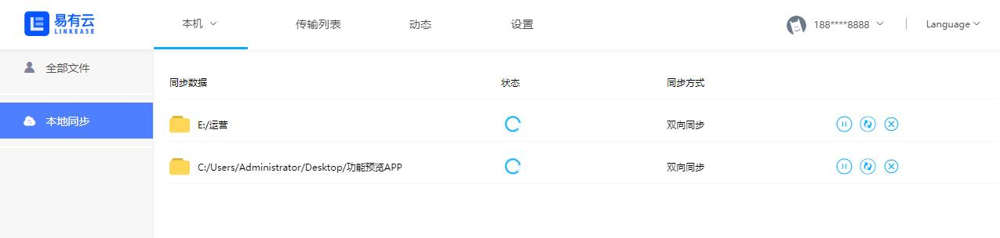

**4.多类型设备绑定**

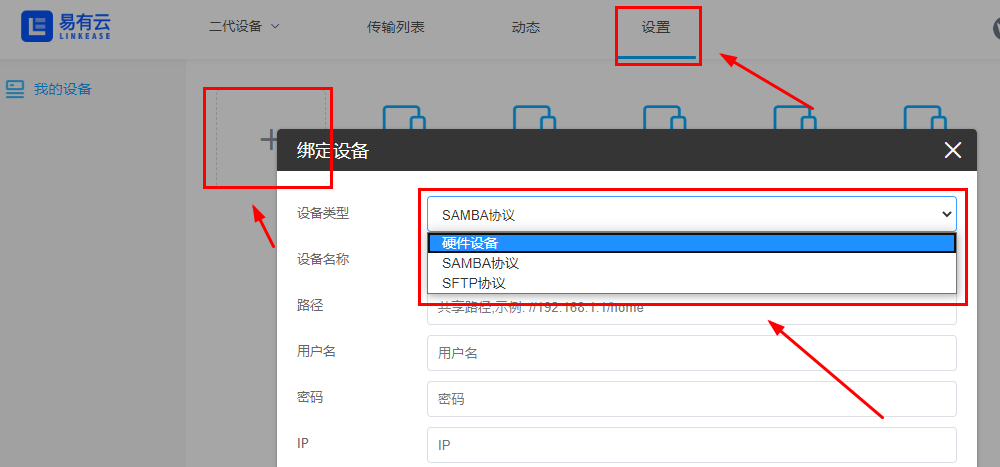

**5.开启本机电脑作为存储端设备，绑定后，可远程访问**

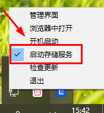

**6.在线创建、编辑Markdown文档，生成Html**

## 小白可轻易上手
易有云是一款多平台的app。买了NAS的朋友都可以安装。支持威联通，群晖和Linux（ARM），各种路由器。

                                         威联通NAS截图
 

                                         群晖截图

                           梅林固件，openwrt固件和lede固件的路由器       

      
在移动端方面，安卓手机和苹果手机都可以安装易有云，Windows电脑，苹果电脑和linux机都有相应的版本。
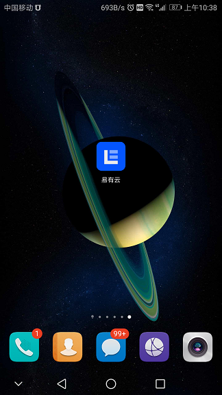

下载网址https://www.ddnsto.com/linkease/download/#/，选择对应的版本下载安装即可。非常容易使用。

## 传输极快

易有云传输极快，并且是在用户 0 配置的情况下实现的。易有云智能的理解用户的各种网络情况，比如：

1. 内网，甚至多级内网之间的通信
2. 用户路由器有公网 IP，且开启 UPNP
3. 用户没有公网 IP，但是支持 UDP 打洞
4. 无公网 IP，无法打动，比如用户 4G 网络

除此之外，易有云的数据传输，也会加了两个特殊能力：

1. 如果是文本等类型的文件，传输自动带压缩
2. 如果是传输同名的文件或者文件夹，自动开启增量传输，即只传输修改部分的数据

### 局域网传输表现

TODO

### UPNP 支持表现

TODO

### 增量传输表现

TODO

### 易有云传输技术不同于 BT 下载等技术

易有云通信时，不会分享您的带宽给别人加速，也不会用别人的带宽给您加速。易有云尽可能使用您自己的带宽来加快通信。

## 自动备份手机相册
易有云可以自动备份手机相册。以安卓手机为例，

首先安装运行易有云APP，点击下面的“文件”

家庭空间或个人空间随便选一个，

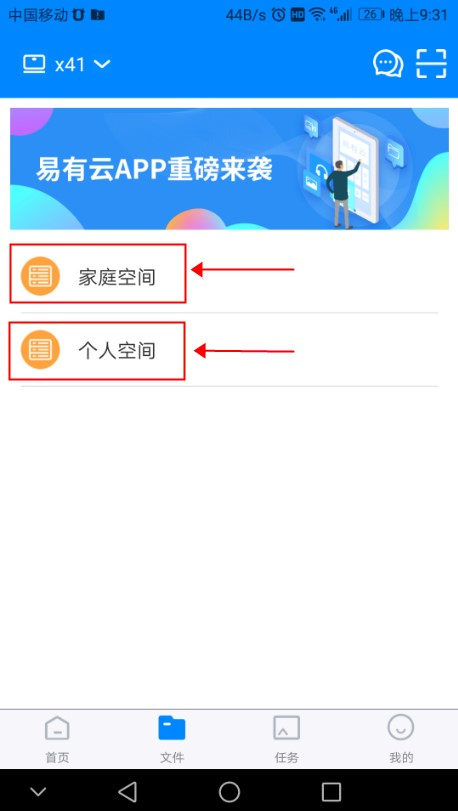

点击右上角的+号，再点击一键备份。
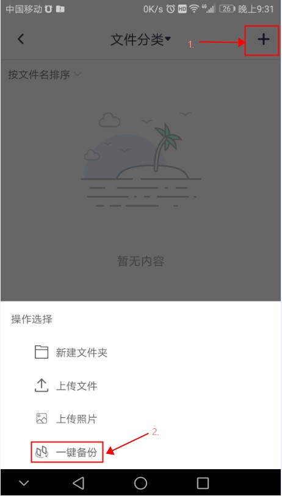

最后这里点击确定。手机相册就开始自动上传了。非常容易。

## 多设备统一管理
如果用户有多台存储设备，可以都绑定到同一个易有云账号下，方便管理。不限制设备数量，不同NAS平台均可，且可以在不同NAS之间互相复制文件。

绑定设备方法，在NAS上登录易有云账号即可绑定该设备。没有易有云账号可以先注册一个。

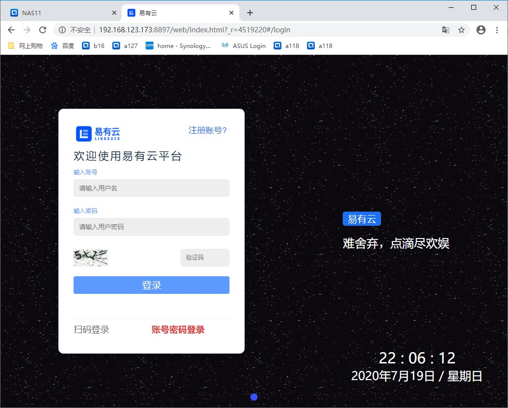

绑定多台设备后，切换设备方法，

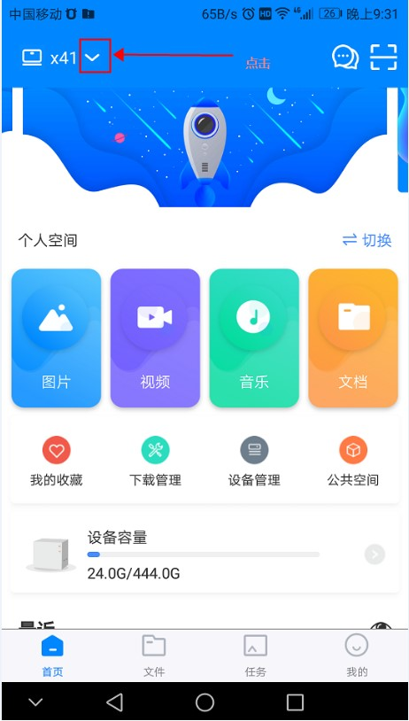

在弹出的设备列表中选择该设备，

用户有需要，可以在不同NAS之前互相复制文件。

首先选择一个文件，点击下面的复制，

再选择要复制到的设备，

最后选择复制，就开始复制到目的设备了。跨设备传输，非常牛。

## 全平台播放器支持

## 数据安全特性说明

### 支持本地两个硬盘的目录软同步

TODO

### 支持异地两台设备的目录容灾备份

TODO

### 支持本地目录的多历史版本备份

TODO

### 服务器不存任何用户的文件数据

1. 如果用户数据直连，则服务器根本无法获取用户的数据
2. 即使数据经过服务器中转，如果走了增量数据同步算法，经过服务器的也只是修改部分的数据
3. 为了减轻成本，服务器没有硬盘存储用户的数据
4. 未来考虑让用户自己提供自己的数据中转服务器
5. 未来考虑让用户设置底层通信的 key （会严重增加使用难度）

## 在线编辑易有云相关Markdown文档教程
### 1.文档整体架构层级：

### 2.截图说明：

2-1.整体目录文件说明：

2-2.语言版本说明：

2-3.中文版本文件说明：

*md文档中可直接上传图片，上传完成后，每个md文档所在位置都会自动生成一个文件夹，单独存放图片（每个md文档对应一个图片文件夹）

### 3.主页左侧导航菜单

左侧菜单md文件

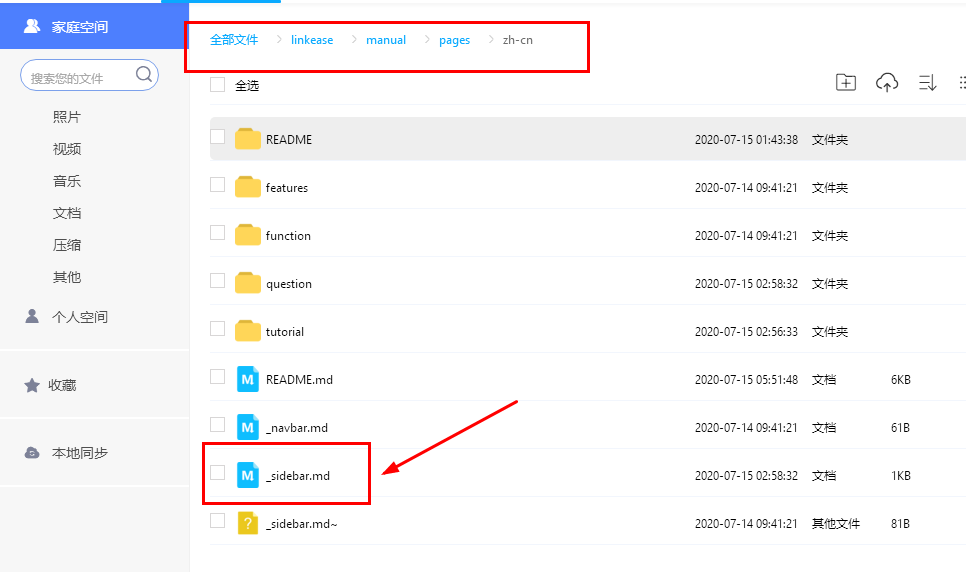
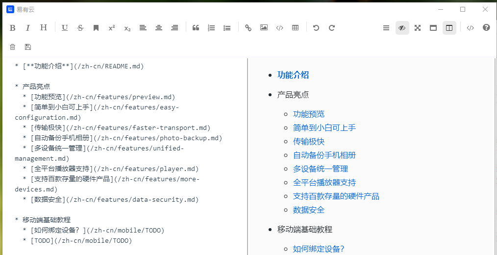

### 4.文档中链接说明

4-1.链接到其他内部md文档：后面小括号内容为所链接的md文档路径

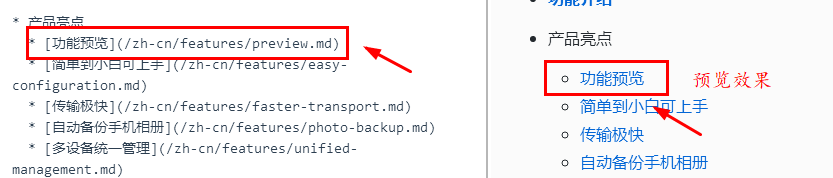

* 链接内部文档之前，需先创建内部md文档： 点击右侧“新建文件”，在出现的文件命名弹窗命名后，将文件后缀设置为“.md”即可。

4-2.连接到外部网址:后面小括号内容为所链接网址
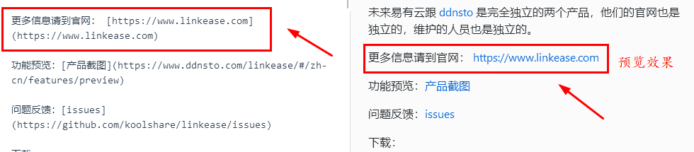

### 5.md文档编辑教程
[教程网址：http://www.mdeditor.com](http://www.mdeditor.com)