## 同步文件

A.设置同步文件（路由器暂不支持）

目前，PC客户端支持同步文件功能。同步方式有“单向同步”及“双向同步”两种，可以根据个人需求选择。

单向同步：在本地同步文件夹中对文件进行操作（创建、修改、删除、改名、移动）后，将会同步更新到云端，但在云端更改同步文件则不会同步到本地；

双向同步：本地和云端实时同步，一端有变化会同步更新到另一端，同步文件夹中本地文件与云端文件始终保持一致。

设置同步文件操作如下：

**1.切换设备时，选择“本机”设备；**

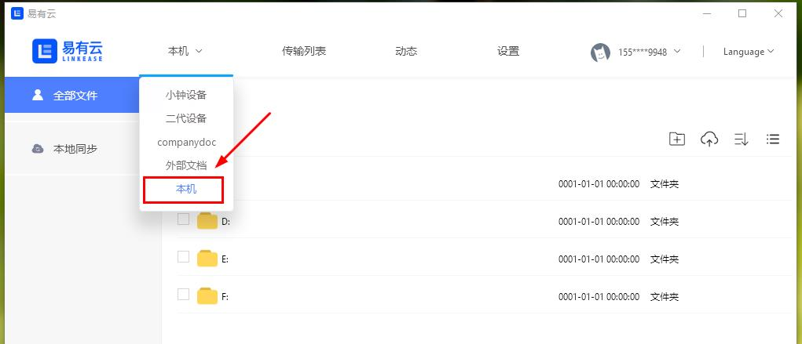

**2.选择我们想要同步的文件夹（单个文件不可同步），点击鼠标右键选择“同步至”；**

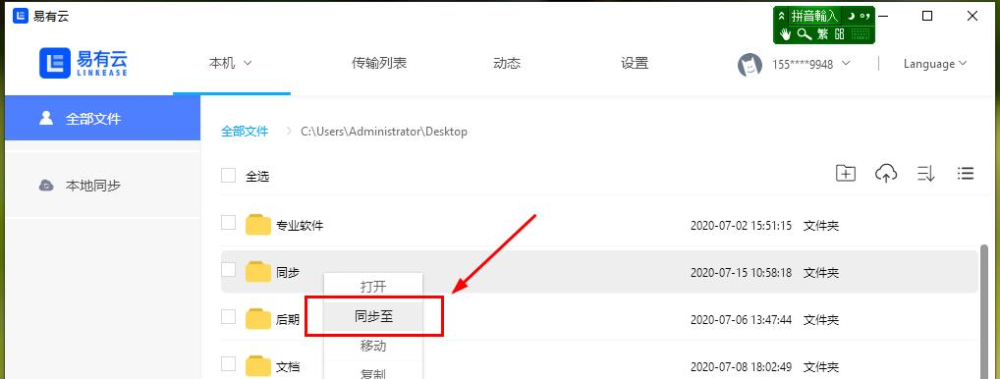

**3.选择要同步至的目的设备目录，点击单向同步或双向同步按钮即可。**

 

B.取消同步文件

**1.点击“我的电脑-全部文件”，选择同步状态进入同步列表，点击同步文件夹右方的“取消同步”按钮；**
 
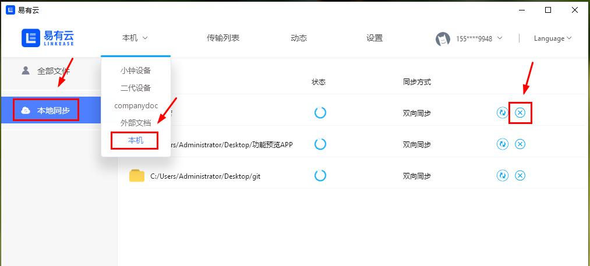

**2.在弹出的窗口中选择“确定”，当同步列表中没有这个文件夹时表示该文件夹已经取消同步成功。**

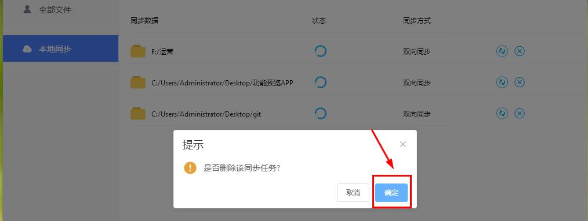

## 编辑文档

如何在线创建、编辑和预览Markdown文档？

**1.点击右侧“新建文件”，在出现的文件命名弹窗命名后，将文件格式后缀设置为“.md”，点击“确定”按钮即可创建Markdown文档。**

*无需另外下载软件安装，无需另外下载软件安装，无需另外下载软件安装，直接在易有云中就可以创建编辑；

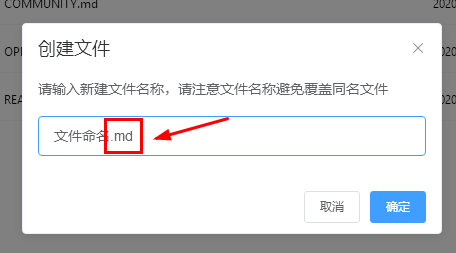

**2.单击Markdown文档，即可在线编辑。编辑完成后，请点击“保存”按钮，否则此次修改无效。点击“关闭”，退出当前编辑页面。**

*生成html：在线生成html文件，单击可打开预览网页；

## 本地存储

如何将本地电脑作为存储端设备绑定？

**1.请先安装易有云客户端，并正常开启运行。**

**2.Windows端(以Win10为例)：点击任务栏中易有云图标，右键即可展开易有云菜单栏，点击“启动存储服务”，即可打开易有云向导页面（网页）；**

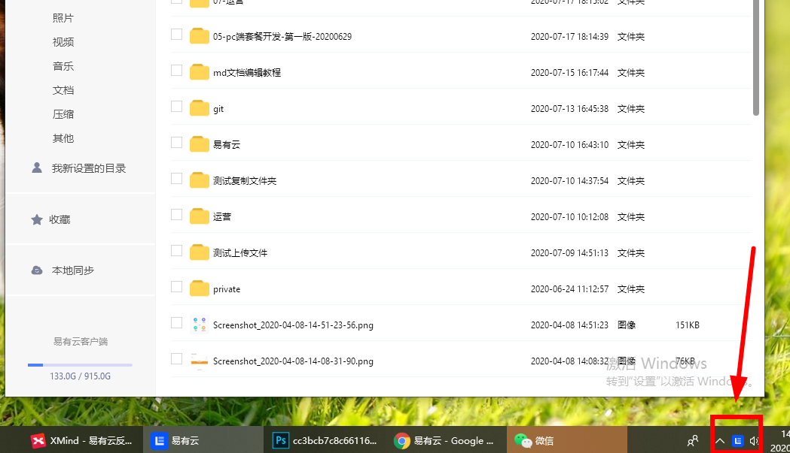

**2-1.Mac端：单击易有云图标，即可展开易有云菜单栏，点击“启动存储服务”，即可打开易有云向导页面（网页）；**

<!--  <strong> *登录时，请使用客户端登录账号，否则无法绑定！</strong> -->
*登录时，请使用客户端登录账号，否则无法绑定！

**4.设置好名称及初始目录路径后，点击"确定"即可绑定！**

*初始目录路径为用户电脑本机上的任一文件夹路径；

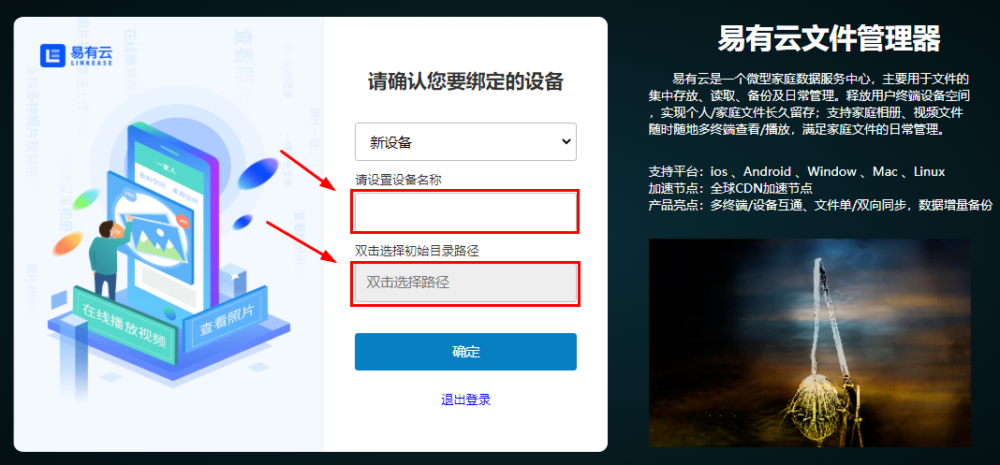

**4.绑定完成后，即可将本机作为存储端设备远程管理访问数据！**

## 下载目录

PC客户端下载后的文件在哪里？（以Win10为例）

客户端及浏览器中文件下载后，保存至本机系统默认的下载路径中。
*"Administrator"为本机用户名

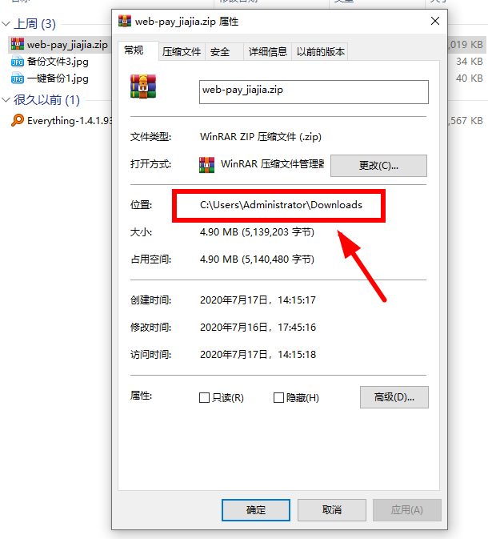

## Samba远程

如何用易有云连接SAMBA远程访问设备文件？
<!-- <blockquote>
连接前，请手动更新存储端与客户端到最新版本；  -->
连接前，请手动更新存储端与客户端到最新版本；

版本更新：[更新下载](https://www.ddnsto.com/linkease/download/)
<!-- </blockquote> -->

**使用场景举例：**

1. 家里路由器安装了易有云 
2. 家里还运行了一台开启了 Samba 服务的设备，且设备上不方便直接安装易有云存储端 
3. 人在公司，需要家里这个 Samba 服务里面的文件

<!-- <blockquote>
 已知玩客云、小米硬盘路由不支持，因为他们的 SAMBA 是 1.0 版本，无法支持。目前易有云支持的是 2.x ~ 3.x 版本 
</blockquote> -->
已知玩客云、小米硬盘路由不支持，因为他们的 SAMBA 是 1.0 版本，无法支持。目前易有云支持的是 2.x ~ 3.x 版本

**前期准备：**

1. 路由器正常运行易有云 
2. SAMBA设备正常运行 
3. PC登录易有云客户端（非存储端！非存储端！非存储端）

**绑定流程：**

**1.鼠标悬浮头像上方，在出现的悬浮框中选择“设置”，进入设备管理页面。点击“添加设备”按钮，在出现的弹窗中，选择“SAMBA协议”。**

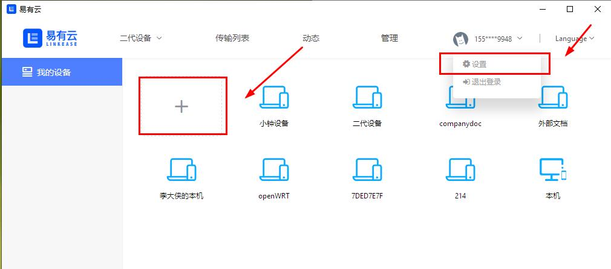

**2.选择关联设备，设备IP为选填项（可选择也可手动输入），建议选择IP，这样数据更准确。**
<!-- <blockquote>
SAMBA 用户名密码，易有云只存本地客户端，不会存服务器。即使是服务器管理人员，也无法知道密码信息，保证个人数据安全。但就是每个客户端都得单独添加一次。；
</blockquote> -->
SAMBA 用户名密码，易有云只存本地客户端，不会存服务器。即使是服务器管理人员，也无法知道密码信息，保证个人数据安全。但就是每个客户端都得单独添加一次。；

**①如果选择了关联设备，那么通信方式如下：**

也就是说，你的本地客户端通过连接关联设备访问到 SAMBA 设备 IP，即在任何外网网络易有云都能保证能连接到 SAMBA。

**②如果不关联设备，那么：**

客户端必须跟 SAMBA 在一个局域网才能访问到 SAMBA 设备。

**端口默认为445，可更改。点击下一步；**

**3.填写工作组，SAMBA设备 用户名和密码，点击下一步；**

**4.填写SAMBA设备 名称及目标路径，目标路径为选填项（可选择也可手动输入），点击绑定；**

<!-- <blockquote>
目标路径即为您要访问的SAMBA设备的共享目录
</blockquote> -->
目标路径即为您要访问的SAMBA设备的共享目录

**5.绑定成功后，该虚拟设备出现在“我的-设备管理”列表页面。您可在“文件”页面访问该虚拟设备中的文件；**

<!-- <blockquote>
SAMBA协议绑定的设备均为虚拟设备，除文件管理外，其他功能均不可用；
</blockquote> -->
SAMBA协议绑定的设备均为虚拟设备，除文件管理外，其他功能均不可用；

## 管理目录

管理员如何设置设备上的用户目录？

**设备管理员点击“管理-目录设置”，进入设备目录设置页面**

**1.设置共享目录/家庭空间：在设备目录设置页面，公共目录板块直接更改目录路径和设置索引即可（共享目录名称不可更改）；**
<!-- <blockquote>
<strong>每个主目录都可以分别设置索引，默认是关闭的。手动开启索引后，即可支持文件智能分类及搜索功能，但占用的CPU会比较高；</strong>
</blockquote> -->
每个主目录都可以分别设置索引，默认是关闭的。手动开启索引后，即可支持文件智能分类及搜索功能，但占用的CPU会比较高；

**2.设置个人目录/个人空间：点击成员列表右侧的箭头，展开个人目录列表；点击"添加"按钮，新增个人主目录；**

**3.输入目录名称，选择目录路径，点击下方保存即可新增目录；**

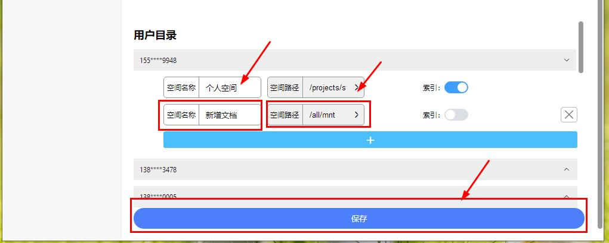

**4.点击目录右侧"删除"按钮，即可删除当前目录；点击索引，即可关闭或开启个人目录索引。**

## 下载目录

如何设置下载目录？

**1.鼠标悬浮在头像上方，在出来的操作栏中点击“设置”，点击“系统设置”。**

**2.点击“浏览”，选择好本地路径后，点击“确定”即可**

*点击“打开”，会直接定位到当前您所选择的目录。

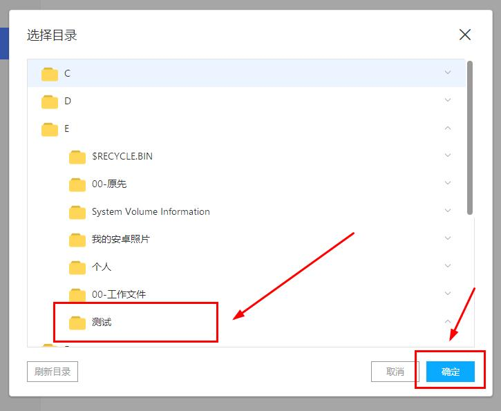

## 更新版本

如何在线更新客户端版本？

**1.正常开启运行易有云客户端。**

**2.Windows端(以Win10为例)：点击任务栏中易有云图标，右键即可展开易有云菜单栏，点击“检查更新”，即可自动更新到最新版本**

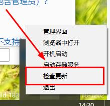

**3.也可以点击下载更新易有云客户端。** [客户端下载](https://www.ddnsto.com/linkease/download/)
