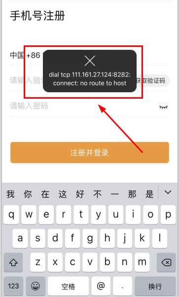
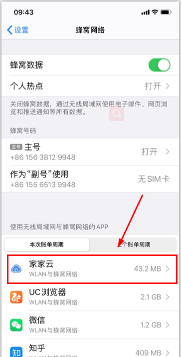
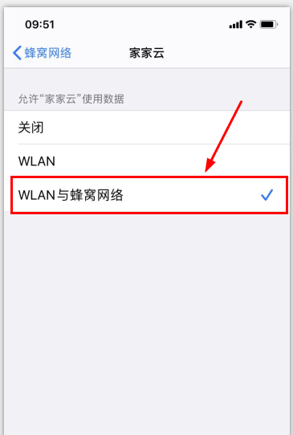
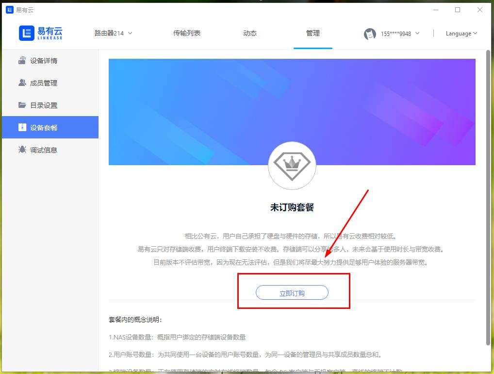
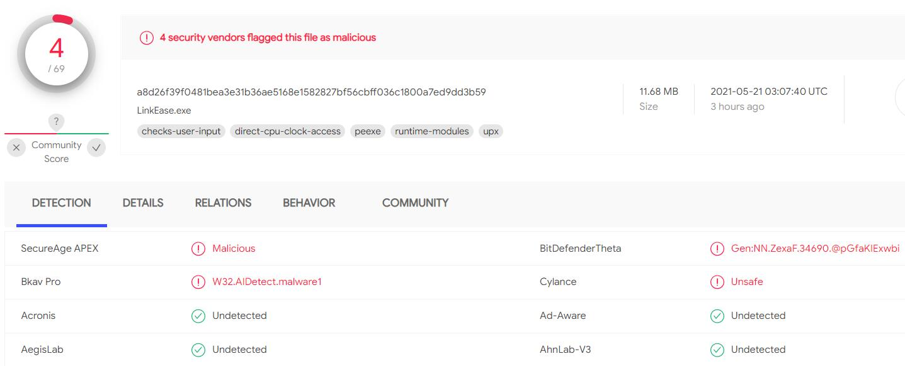

## 常见问题

#### Q: 易有云1.0升级到2.0的方案计划：

1. 易有云1.0与2.0将独立运行一段时间，服务器是独立的，客户端也是独立的；
2. 易有云1.0 iOS端里面增加“自动购买到2.0 26元套餐”的功能。也就是1.0升级到2.0自动获得26元套餐；
3. 易有云1.0的用户也可以选择继续使用1.0一段时间(目前1.0还能运行多少时间不确定)。

#### Q: 易有云2.0跟1.0区别？

1. 2.0增加了存储端与用户端的概念，存储端相当于服务器端；
2. 2.0可以给多个人使用；
3. 2.0可以设置多个目录，并且每个人都可以设置独立的目录；
4. 其它很多很多功能使用的提升。

#### Q: 关于iOS注册失败问题？
如iOS用户出现下图注册提示，请检查本机家家云是否已开启网络权限。

开启权限方法(以iOS11为例)：
在“设置-蜂窝网络”页面找到家家云，点击进入网络设置页面，在页面上选择“WLAN与蜂窝网络”即可。

#### Q: 关于易有云v2.0安装失败问题(Android)?
目前Android手机无法同时安装易有云v1.0和易有云v2.0，所以，在您安装易有云v2.0软件包前，请提前卸载易有云v1.0。

#### Q: 为何没传输数据，看监控易有云还用流量？

1. 是不是开启了双向同步。

查看本机的双向同步列表：

2. 是不是别人在传输文件给你，或者你后台还在传输文件。

查看本机的传输列表：

3. 是不是打开了播放器，然后关闭播放器，播放器还在后台播放。

#### Q: 无法连接服务器？

如果您无法访问易有云服务器，可能是因为：

存储端时间跟服务器时间没有同步，误差太大，将导致无法连接服务器，进而无法使用我们易有云的服务！

#### Q: 删除设备后，如何找回设备套餐？

1.在设备列表页面，切换未购买套餐的设备。在出现的购买套餐提示弹窗上，点击“查看详情”，进入设备套餐页面；

2.在设备套餐页面点击“立即订购”按钮，会出现系统提示，提示您当前还有暂未使用的套餐；

3.点击套餐列表后的“立即使用”，确认后，即可使用您已购买过的套餐，无需再次购买；

4.完成后，设备套餐相关会出现相关套餐信息。

#### Q: Windows客户端被检测出风险？纯属误报！

现在Windows端被少数几家病毒库检测出存在风险，应该是命中了某些特征导致的误报：

[检测说明](https://www.virustotal.com/gui/file/a8d26f39f0481bea3e31b36ae5168e1582827bf56cbff036c1800a7ed9dd3b59/detection)

**这是属于误报，大家不要担心，就是命中了某些特征而已，各种实测、反馈都是没问题的。**

