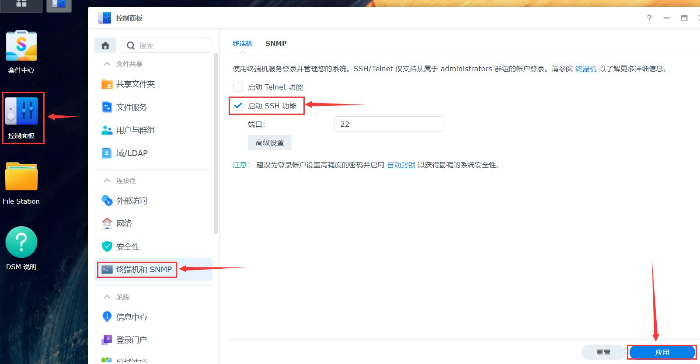

## 各种设备安装存储端

### 1. 群晖

**1.点击“ [存储端下载](https://firmware.koolshare.cn/binary/LinkEase/Synology/)”，下载Synology插件，教程示例群晖是x86平台，所以此处选择"X86"；**

<!-- <font color="#ff0000">*请根据自己电脑上的CPU型号选择相对应的存储端</font><br /> -->
*请根据自己群晖的CPU型号以及DSM版本选择相对应的存储端(DSM7.0请先卸载旧版本)


**2.登录群晖操作系统，点击套件中心，在出现的套件中心弹窗上点击“手动安装”；**


**3.选择已下载的插件上传，按照指示步骤完成插件安装；**


**4.插件安装完成后，点击群晖系统左上角“主菜单”，在出现的主菜单页面点击“易有云”或“易有云设置”均可进入易有云向导页面；**


**DSM7.0的设置入口在套件中心—已安装—LinkEaseAgent：**


**5.安装后第一次打开，需要绑定设备，请查看“存储端统一绑定教程”。**


#### 注意！由于DSM7.0对权限严格控制，所以额外配置权限(DSM6的用户无需处理)。有两种方法配置：

- 方法一： 进入“控制面板”—“共享文件夹”, 在选择文件夹上右键选择“编辑”，选择“权限”页签，在页签内用户选择器选择“系统内部用户账户”, 找到“linkease”，勾选“可读写”，最后保存。


- 方法二：如果有root权限，开启ssh后进入群晖终端，执行以下两条指令：

1.先开启ssh：“控制面板”—“终端机和SNMP”—“启用SSH功能”—应用。


2.登录群晖SSH，终端执行：
```
sudo  sed -i 's/package/root/g' /var/packages/LinkEaseAgent/conf/privilege

sudo /usr/syno/bin/synopkg restart LinkEaseAgent
```


### 2. 威联通

**1.点击“ [存储端下载](https://firmware.koolshare.cn/binary/LinkEase/QNAP/)”，下载QNAP插件，此处选择"LinkEaseAgent_0.2.83_x86_64.qpkg"；**

<!-- <font color="#ff0000">*请根据自己电脑上的CPU型号选择相对应的存储端</font><br /> -->
*请根据自己电脑上的CPU型号选择相对应的存储端


**2.登录QNAP操作系统，点击"APP Center"，在出现的APP Center弹窗上点击“安装软件图标”；**


**3.选择已下载的插件上传，按照指示步骤完成插件安装；**


**4.插件安装完成后，点击APP Center弹窗上出现的“易有云”或主页面上的“易有云”均可进入易有云向导页面；**


**5.安装后第一次打开，需要绑定设备，请查看“存储端统一绑定教程”。**


### 3. 华硕NAS

**1.首先，点击[存储端下载](https://firmware.koolshare.cn/binary/LinkEase/Asus-Nas/)，下载易有云APK。访问NAS主页面，打开华硕`App Central`：**


**2.然后，点击`管理`菜单选项，选择`手动安装`选项卡。点击`浏览`按钮，选择下载好的APK文件**


**3.点击`上传`按钮，上传插件，等待华硕检查完成。勾选`我了解安装未经验证的app的风险`并点击`安装`，等待安装完成。**


**4.安装完毕后，框内是插件开关，打开后会启动插件，点击红色箭头处的按钮，即可访问易有云界面。**


**5.安装后第一次打开，需要绑定设备，请查看“存储端统一绑定教程”。**


### 4. Koolshare梅林
*绑定设备前，请确保您已在路由器端接入容量不小于16GB的存储设备，如U盘，移动硬盘等；

**1.登录固件管理端，点击“软件中心”，进入软件中心页面。点击“未安装”，进入未安装的插件页面；**


**2.选中“易有云2.0”，点击“安装”，安装易有云插件；**


**3.安装完成后，在“已安装”页面找到易有云2.0插件，单击打开；**


**4.调整开关状态为“开启”，点击“配置中心”，进入易有云2.0向导页面；**


**5.安装后第一次打开，需要绑定设备，请查看“存储端统一绑定教程”。**


### 5. Koolshare Lede 
*绑定设备前，请确保您已在路由器端接入容量不小于16GB的存储设备，如U盘，移动硬盘等；

**1.登录设备固件管理端，点击“酷软”，进入软件中心页面。点击“未安装”，进入未安装的插件页面；选中“易有云2.0”，点击“安装”，安装易有云插件；**

*易有云1.0和易有云2.0为2个不同插件，安装时，请确认安装的为易有云2.0；


**2.安装完成后，在“已安装”页面找到易有云2.0插件，单击打开；**


**3.勾选“开启LinkEase”，点击“保存”，开启运行易有云2.0；**


**4.确认易有云进程正常开启后，点击“WEB控制台”一栏右侧网址，进入易有云2.0向导页面；**


**5.安装后第一次打开，需要绑定设备，请查看“存储端统一绑定教程”。**


### 6. Openwrt
*绑定设备前，请确保您已在路由器端接入容量不小于16GB的存储设备，如U盘，移动硬盘等；

**1.OpenWrt固件开发者众多，部分固件不自带易有云，可通过以下任一脚本轻松安装：**

   via curl
```
sh -c "$(curl -sSL http://firmware.koolshare.cn/binary/LinkEase/Openwrt/install_linkease.sh)"
```
   via wget
```
sh -c "$(wget --no-check-certificate -qO- http://firmware.koolshare.cn/binary/LinkEase/Openwrt/install_linkease.sh)"
```
   others
```
cd /tmp; wget --no-check-certificate http://firmware.koolshare.cn/binary/LinkEase/Openwrt/install_linkease.sh; sh ./install_linkease.sh
```

**2.在OpenWrt TTYD终端中输入任一上述命令，会自动安装完成。**


**3.然后找到易有云，启用并应用保存，然后点击“打开易有云”。**


**4.或者putty、MobaXterm等软件登陆SSH，输入任一上述命令，会自动安装完成。**

**5.安装后第一次打开，需要绑定设备，请查看“存储端统一绑定教程”。**


### 7. Linux 通用版
[存储端下载链接](https://firmware.koolshare.cn/binary/LinkEase/LinuxStorage/)

<font color="#ff0000">*请根据自己电脑上的CPU型号选择相对应的存储端</font><br />


**1.首先在命令窗口中登录您的linux系统**

<font color="#ff0000">以下按照我本机上的文件目录作为解说：</font><br />

**2.在光标后输入“cd mtb” ，点击回车，进入mtb目录中（mtb为您下载文件后存放的目标目录）。输入“ls”确认；**
 <table><tr><td bgcolor=#bae2fe>cd mtb</td></tr></table>


**3.在光标后输入"wget 存储端链接"，点击回车，下载易有云存储端。输入“ls”确认；**
 <table><tr><td bgcolor=#bae2fe>wget 
https:/ / firmware.koolshare.cn/binary/LinkEase/LinuxStorage/linkease.amd64</td></tr></table>

<font color="#ff0000">以上网址为易有云linux通用版存储端链接，后期有可能会更改，请您随时关注更新；</font><br />


**如何获取易有云linux存储端链接**

点击[存储端下载链接](https://firmware.koolshare.cn/binary/LinkEase/Synology/)，打开易有云存储端下载链接。右键“linkease.amd64”文件，在出现的弹窗中单击“复制链接地址”，即可复制该存储端链接。


**4.在光标后输入“chmod 755 linkease.amd64”给予软件运行权限。输入“ls”确认；**
<table><tr><td bgcolor=#bae2fe>chmod 755 linkease.amd64</td></tr></table>


**5.在光标后输入“./linkease.amd64”，点击回车，运行软件；**
<table><tr><td bgcolor=#bae2fe>./linkease.amd64</td></tr></table>


**6.复制命令窗中出现的网址在浏览器中打开，即可进入易有云向导页面**


**7.安装后第一次打开，需要绑定设备，请查看“存储端统一绑定教程”。**


### 8. ReadyNAS

TODO


### 9. Docker

**Docker方式安装易有云存储端，包括并不限于Unraid/爱快/群晖等，只要有Docker的设备都成，一些Linux发行版等。**

所以说Docker方式基本算是适合全设备，操作也比较简单，下面开始教程：

**终端运行以下命令：(先不要直接复制，看下面的说明)**

```
docker run -d \
    --cap-add=NET_ADMIN \
    -p 8897:8897 \
    --name=linkease \
	--network host \
    -v /etc/localtime:/etc/linkease-data \
    -v /etc/localtime:/etc/linkease-config \
    -v /etc/localtime:/etc/localtime:ro \
    -e PUID=<uid for user> \
    -e PGID=<gid for user> \
    linkease/linkease:latest
```

1. PUID/PGID：获取方式：终端输入id即可。


   
比如上图获取的UID和GID都是0。

2.注意要替换 "<>" 里面的内容，且不能出现 "<>"。

3.准备工作做好了，那我的终端命令就是：

```
docker run -d \
    --cap-add=NET_ADMIN \
    -p 8897:8897 \
    --name=linkease \
	--network host \
    -v /etc/localtime:/etc/linkease-data \
    -v /etc/localtime:/etc/linkease-config \
    -v /etc/localtime:/etc/localtime:ro \
    -e PUID=0 \
    -e PGID=0 \
    linkease/linkease:latest
```

4.Docker在某些Linux发行版，可能要加上“sudo”前缀才能运行，按提示输入Linux的密码，命令如下：

```
sudo docker run -d \
    --cap-add=NET_ADMIN \
    -p 8897:8897 \
    --name=linkease \
	--network host \
    -v /etc/localtime:/etc/linkease-data \
    -v /etc/localtime:/etc/linkease-config \
    -v /etc/localtime:/etc/localtime:ro \
    -e PUID=0 \
    -e PGID=0 \
    linkease/linkease:latest
```

5.安装后第一次打开(访问地址: http://docker设备ip:8897)，需要绑定设备，请查看“存储端统一绑定教程”。


**注意事项：**

易有云尽可能使用点对点进行网络传输，所以在使用 Docker 的时候，为了避免给易有云增加了一层 NAT，建议网络配置使用：

**Host 模式：**
即用本主机的网络，减少了一层NAT

**Custom br0 模式：**
即把Docker里面的网络连接到一个局域网中，最好是得到根主机一个网段的IP，也能少一层NAT

否则会让易有云无法充分利用本地局域网的网络通信，影响网速，同时影响网络发现、远程samba等等功能特性。(即可以通过易有云远程访问局域网其它的samba共享路径)

[镜像地址](https://hub.docker.com/r/linkease/linkease/)


### 10. Windows

**1.点击[存储端下载](https://www.ddnsto.com/linkease/download/#/disk/)，选择Windows存储端下载；**


**2.下载的LinkEaseWin.zip，解压成文件夹，然后直接点击LinkEase.exe(绿色软件不用安装)运行；**

**3.按提示登录易有云账号，选择“本机”就能看到当前电脑上的硬盘；**


**4.然后登录手机易有云，首页——我的终端，选择“Windows图标”；**


**5.这样就能在手机端直接浏览电脑上的硬盘内容了。**


**6.Windows存储端，不用再另外绑定，不用看下面的“存储端统一绑定教程”，打开程序界面扫码登录就成。**


### 11. macOS

**1.点击[存储端下载](https://www.ddnsto.com/linkease/download/#/disk/)，选择MacOS存储端下载；**


**2.访达——下载，找到LinkEase.dmg，点击安装；**


**3.启动台，找到易有云运行，按提示登录易有云账号，选择“本机”就能看到当前电脑上的硬盘；**


**4.然后登录手机易有云，首页——我的终端，选择“苹果图标”；**


**5.这样就能在手机端直接浏览电脑上的硬盘内容了。**


**6.MacOS存储端，不用再另外绑定，不用看下面的“存储端统一绑定教程”，打开程序界面扫码登录就成。**


## 存储端统一绑定教程

易有云存储端安装后第一次打开，需要绑定设备。易有云存储端与客户端一一对应，绑定成功后，每次在存储端登录时，需使用绑定的账号登录。否则，在该存储端的向导页面将无法登录；

**1.在易有云2.0向导页面登录客户端；**

 ①方式一：打开手机易有云，扫描登录二维码登录；<br/>
 ②方式二：输入您所注册的易有云账号密码进行登录；


**2.登录后，进入设备初始设置页面，设置设备名称及初始目录路径；**
* 双击选择路径，可以选择NAS内的目录，也可以选择你的挂载的硬盘目录，这个目录会用来存放易有云的配置文件（不是你分享的数据）。
* 绑定完成后，您可前往“个人空间”查看该初始目录路径下的文件数据。


**3.操作成功后，即可在易有云2.0客户端使用该账号管理设备文件。**


