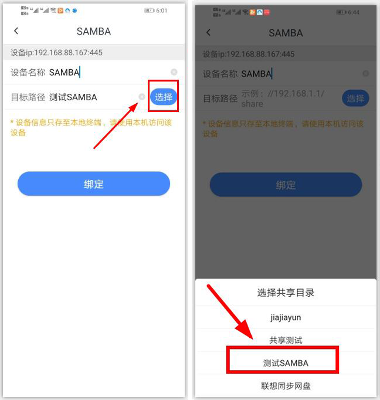
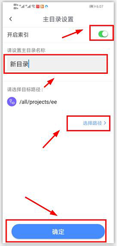
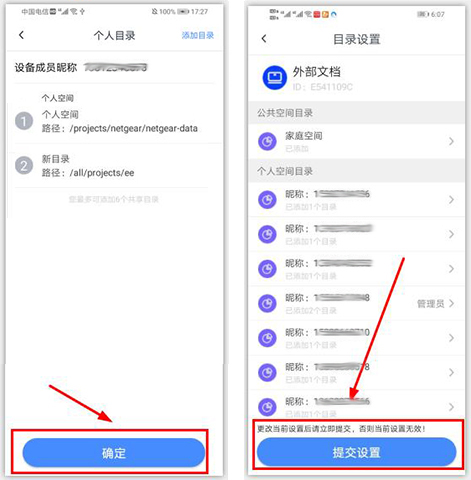
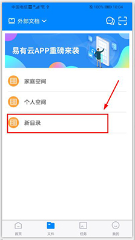

# 移动端基础教程
 ## 管理员如何绑定和共享设备？

### 绑定设备：开启手机Wi-fi，并确保您的手机与要绑定的设备在同一路由器网络下

**1.打开手机App，系统会自动扫描局域网内可绑定设备，点击进入搜索的设备列表页面；**

*您也可以点击“我的-设备-添加设备”，通过扫描设备二维码等其他方式绑定设备。

**2.点击要绑定的设备，进入绑定设备确认页面；**

**3.点击“下一步”，进入设备初始设置页面；**

**4.根据页面提示设置好“设备名称”及“初始路径”，点击“确定”按钮即可绑定设备；**

 ***首位用户绑定设备后成为该设备的管理员，一个设备只能有一个管理员。** 

### 共享设备
 只有管理员才能主动分享设备，每台设备最多可邀请19位成员共享。 

**1.设备管理员在“我的-设备”列表页面（iOS），点击要分享的设备，进入设备共享成员列表页面。点击“添加共享”，输入要添加的成员手机号码后点击确定即可；**
*安卓用户请点击“我的-设备管理-进入设备-设备成员”，进入成员列表页面进行相应操作；

**2.受邀成员在app“首页-消息”中接受设备邀请即可共享该设备。**

## 如何解绑和取消共享？
登录app后，点击“我的-设备”，进入设备列表页面。左滑要删除的设备，点击“删除设备”即可（ios）。为保障用户的数据安全，如管理员想删除自己的设备，需先取消所有设备共享成员方可删除。
*安卓用户可点击“我的-设备管理-进入设备”，在设备详情页面点击“删除设备”即可。

如管理员想要取消他人共享，点击设备，进入该设备共享成员列表页面，左滑要取消的用户，点击“取消共享”即可。

*安卓用户可点击“我的-设备管理”点击具体设备，在设备详情页面点击“成员管理”，进入成员列表页面进行相应操作即可。

 ***设备删除和取消共享后，将会删除该用户在这台设备上的所有个人空间数据，且无法找回，请谨慎操作！** 

## 一键备份与自动备份有什么区别？

**1）一键备份：为即时性和一次性操作；**

登录APP后在“文件-个人空间”页面，点击右上角按钮“＋”，选择一键备份，系统会即时备份手机文件。

**2)自动备份（ios）：持续性操作**

在IOS设备上点击“我的-自动备份”，选择好备份位置，系统即可后台持续备份手机文件。 如需上传原画级别，请开启“上传原文件”。

**3）备份默认将文件备份到个人空间，备份完成后会以“手机名称＋照片备份”来命名的文件夹呈现。**

备份时，系统会自动识别手机文件，且按照手机型号与文件日期自动去重。

## 如何实现文件在微信与易有云之间的互传（iOS）？

### 一、使用微信分享易有云已下载文件
**在操作前，请先在家家云（易有云临时替代版本）里下载需要传输的文件**

**1.在微信聊天窗里点击“上传-文件”；**

**2.在文件目录选择页面，切换并选中“icloud”；**

**3.在出现的页面中，点击下方“浏览”，找到家家云，并点击进入家家云文件列表页面；**

**4.选中具体文件后即可分享文件给微信好友。**

### 二、使用微信上传文件至易有云

*此方式限制文件大小不得超过100M（微信本身限制）

**1.在微信中打开要上传的文件；**

**2.点击右上角操作图标，打开操作栏；**

**3.点击“用其他应用打开”；**

**4.选中“易有云”，确定上传即可。**

## 如何用易有云连接SAMBA远程访问设备文件？
<!-- <blockquote>
<front color="#DC143C">连接前，请手动更新存储端与客户端到最新版本；</front>  -->
连接前，请手动更新存储端与客户端到最新版本；
版本更新： [https://www.ddnsto.com/linkease/download/#/](https://www.ddnsto.com/linkease/download/#/)
<!-- </blockquote> -->

**使用场景举例：**

1. 家里路由器安装了易有云 
2. 家里还运行了一台开启了 Samba 服务的设备，且设备上不方便直接安装易有云存储端 
3. 人在公司，需要家里这个 Samba 服务里面的文件

<!-- <blockquote>
<front color="#DC143C"> 已知玩客云、小米硬盘路由不支持，因为他们的 SAMBA 是 1.0 版本，无法支持。目前易有云支持的是 2.x ~ 3.x 版本</front> 
</blockquote> -->
已知玩客云、小米硬盘路由不支持，因为他们的 SAMBA 是 1.0 版本，无法支持。目前易有云支持的是 2.x ~ 3.x 版本

**前期准备：**

1. 路由器正常运行易有云 
2. SAMBA设备正常运行 
3. 手机登录易有云客户端

**绑定流程：**

**1.登录APP，点击“我的-设备管理”，进入设备列表页面。点击右上角添加设备图标，选择SAMBA；**

**2.选择关联设备，设备IP为选填项（可选择也可手动输入），建议选择IP，这样数据更准确。**
<!-- <blockquote>
<front color="#DC143C">SAMBA 用户名密码，易有云只存本地客户端，不会存服务器。即使是服务器管理人员，也无法知道密码信息，保证个人数据安全。但就是每个客户端都得单独添加一次。；</front>
</blockquote> -->
SAMBA 用户名密码，易有云只存本地客户端，不会存服务器。即使是服务器管理人员，也无法知道密码信息，保证个人数据安全。但就是每个客户端都得单独添加一次。

**①如果选择了关联设备，那么通信方式如下：**

也就是说，你的本地客户端通过连接关联设备访问到 SAMBA 设备 IP，即在任何外网网络易有云都能保证能连接到 SAMBA。

**②如果不关联设备，那么：**

客户端必须跟 SAMBA 在一个局域网才能访问到 SAMBA 设备。

**端口默认为445，可更改。点击下一步；**

**3.填写工作组，SAMBA设备 用户名和密码，点击下一步；**

**4.填写SAMBA设备 名称及目标路径，目标路径为选填项（可选择也可手动输入），点击绑定；**

<!-- <blockquote>
<front color="#DC143C">目标路径即为您要访问的SAMBA设备的共享目录</front>
</blockquote> -->
目标路径即为您要访问的SAMBA设备的共享目录

**5.绑定成功后，该虚拟设备出现在“我的-设备管理”列表页面。您可在“文件”页面访问该虚拟设备中的文件；**

<!-- <blockquote>
<front color="#DC143C">SAMBA协议绑定的设备均为虚拟设备，除文件管理外，其他功能均不可用；</front>
</blockquote> -->
SAMBA协议绑定的设备均为虚拟设备，除文件管理外，其他功能均不可用；

## 管理员如何设置设备上的用户目录？

**1.设备管理员点击“我的-设备管理-目录设置”，进入设备目录设置页面。点击用户列表，进入用户个人目录列表页面。点击页面右上角"添加目录"，进入个人目录添加设置页面；**

<!-- **2.设置目录索引，输入目录名称，选择目录路径，点击下方"确定"即可新增目录；**
<blockquote>
<front color="#DC143C"><strong>每个主目录都可以分别设置索引，默认是关闭的。手动开启索引后，即可支持文件智能分类及搜索功能，但占用的CPU会比较高；</strong></front>
</blockquote> -->

每个主目录都可以分别设置索引，默认是关闭的。手动开启索引后，即可支持文件智能分类及搜索功能，但占用的CPU会比较高；

**3.目录设置需要多次确认方可生效，新建目录完成后，会自动跳转至个人目录列表页面。点击“确定”，会自动跳转至目录设置页面，请在目录设置页面点击“提交”，提交完成后，您此次所更改的目录即可生效。；**

**4.设置完成后，被设置的用户即可在“文件”主目录列表页面看到最新设置的主目录；**

