## 绑定设备

管理员如何绑定设备？

**绑定设备：开启手机WiFi，并确保您的手机与要绑定的设备在同一路由器网络下。**

**1.打开手机App，系统会自动扫描局域网内可绑定设备，点击进入搜索的设备列表页面；**

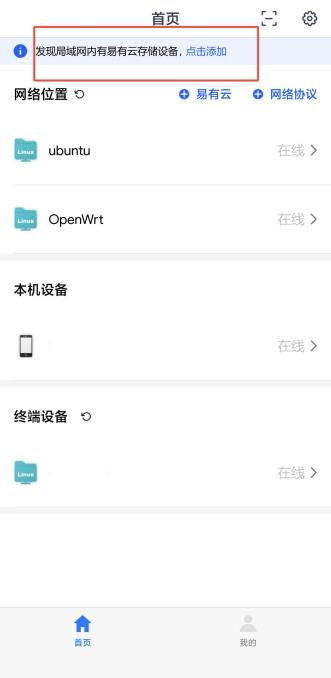

**2.点击要绑定的设备，进入绑定设备确认页面；**

**3.点击“下一步”，进入设备初始设置页面；**

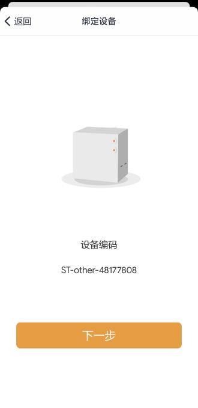

**4.根据页面提示设置好“设备名称”及“初始路径”，点击“确定”按钮即可绑定设备；**

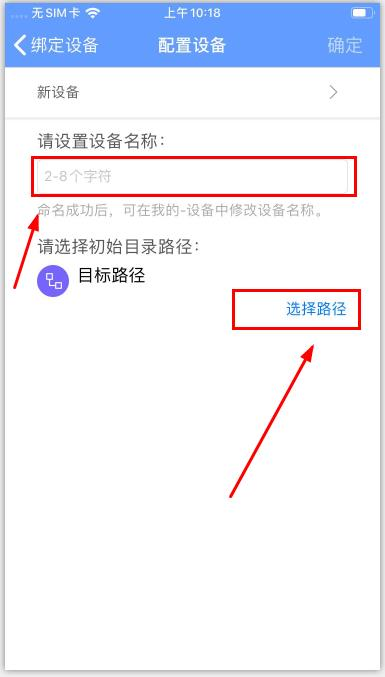

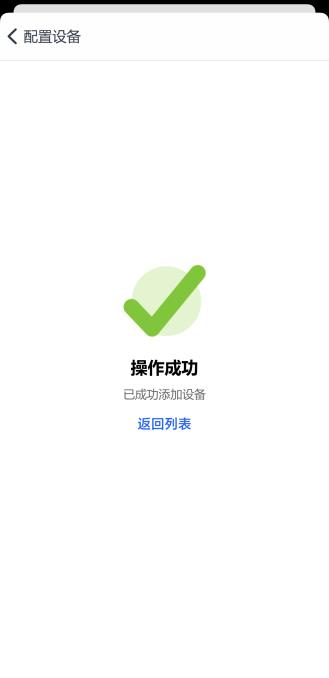

***也可以点击首页的“+易有云”按钮，通过扫描设备二维码等其他方式绑定设备。**

 ***首位用户绑定设备后成为该设备的管理员，一个设备只能有一个管理员。** 

## 共享设备

管理员如何共享设备？

**只有管理员才能主动分享设备，每台设备最多可邀请多位成员共享。(目前最多3位，后续敬请期待)**

**1.设备管理员在首页点击右上角的“齿轮”按钮，点击要共享设备的“成员管理”，然后添加成员，输入受邀成员的手机号。**

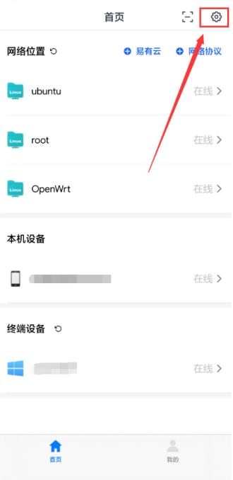

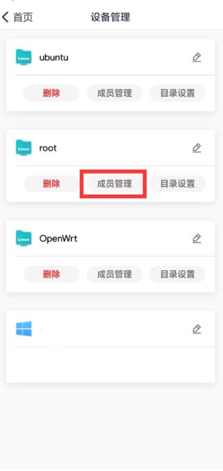

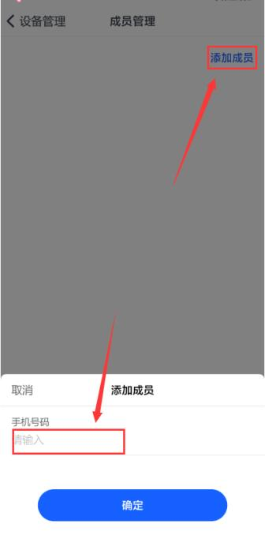

**2.受邀成员在首页点击“+易有云”按钮，出来弹窗点击“接受共享设备”的消息中接受设备邀请即可共享该设备。**

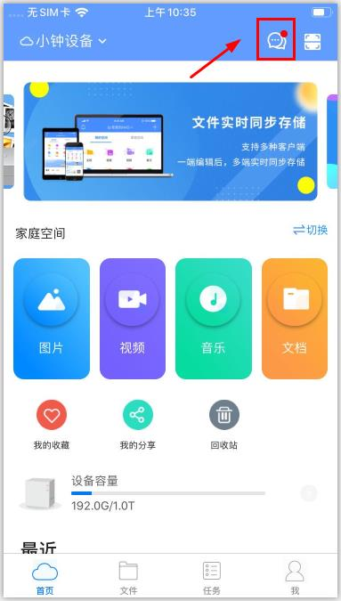

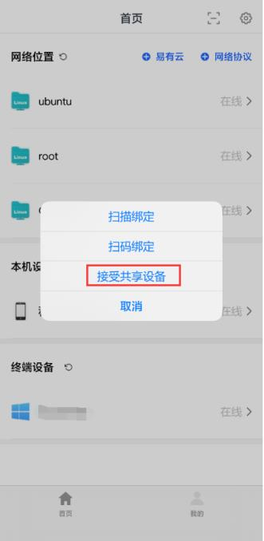

## 取消共享

如何解绑和取消共享？

**易有云APP首页，点击右上角“齿轮”图标，然后点击已共享设备的“成员管理”，然后看到共享的成员，删掉即可。**

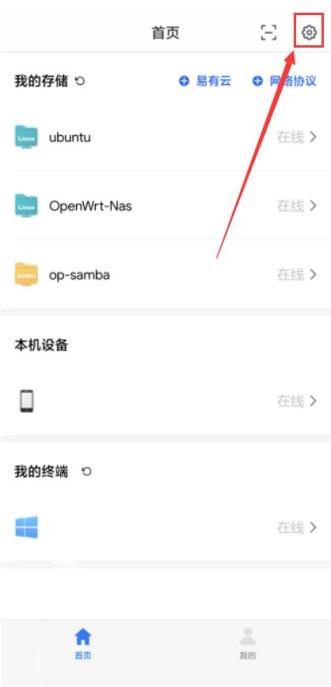

 ***设备删除和取消共享后，将会删除该用户在这台设备上的所有个人空间数据，且无法找回，请谨慎操作！** 

## 来自终端

来自终端是个啥？

**就是复制samba、sftp、webdav等特殊协议的配置信息。**

比如：你的账号在手机A1的易有云APP上添加了samba，在手机A2的易有云APP上登录你的账号，可以直接复制手机A1上的samba的配置信息在手机A2上快速配置绑定samba。

**1.新设备的易有云APP首页，点击“+网络协议”，出来弹窗选择“来自终端”；**

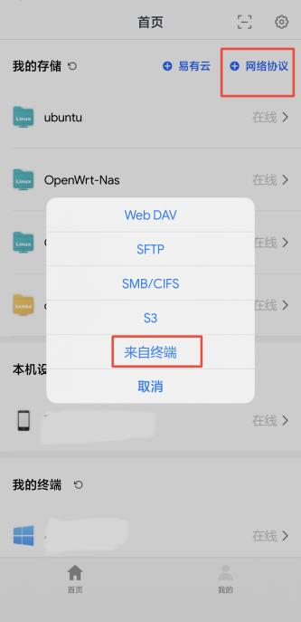

**2.就能发现旧设备已经配置好的samba等协议的配置(如果你在旧设备配置了多个协议，就能看见多个)；**

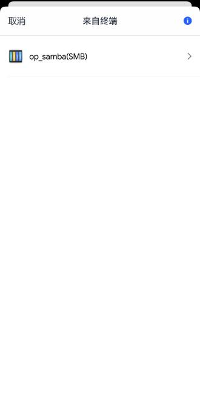

**3.点击你要复制的协议配置，然后“启用设备配置信息”，输入密码后，绑定即可。**

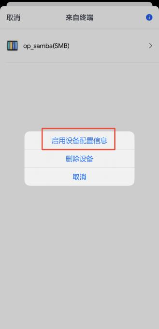

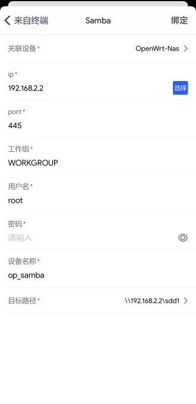

PS：如果在新设备上“删除设备”或者修改，不会影响旧设备，均为本地操作。

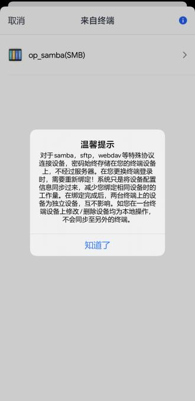

## 相册备份

如何备份相册呢？

### iOS客户端

**1.易有云APP打开“我的”，然后点击“照片备份”；**

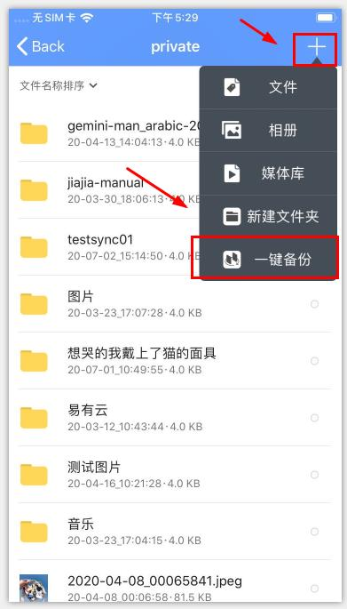

**2.然后继续点击“照片备份”，出来的弹窗点击“选择目标设备”；**

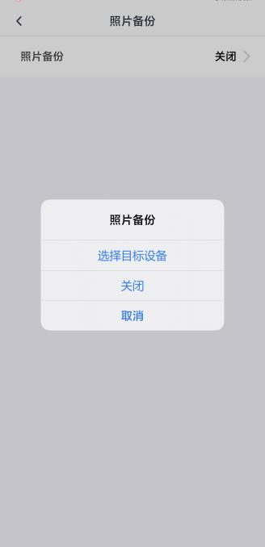

**3.然后选择设备，然后选择目录；**

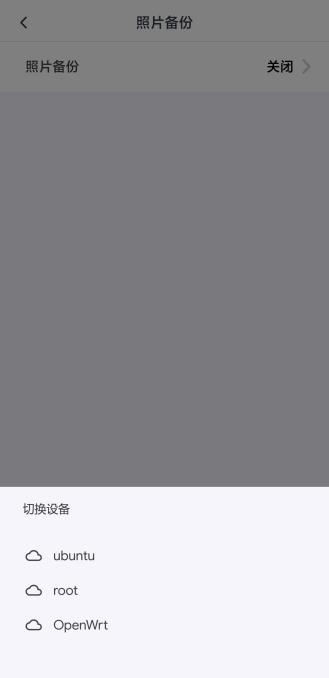

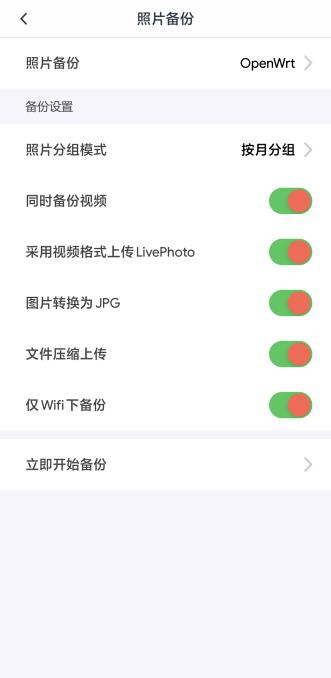

**4.选好目录后，就能看到一些设置选项；**

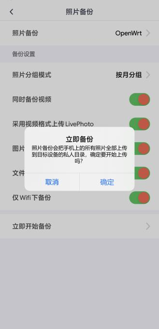

**5.设置好就可以点击“立即开始备份”，以后就可以自动备份相册了。**

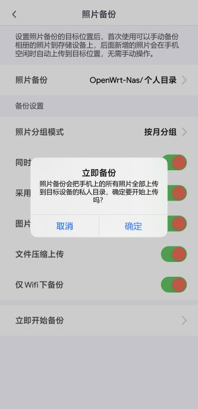

### Android客户端

**1.易有云APP打开“我的”，然后点击“照片备份”；**

**2.打开“相册备份”，然后选择“备份路径”；**

PS：备份路径，右边先选择设备，左边再选择目录。

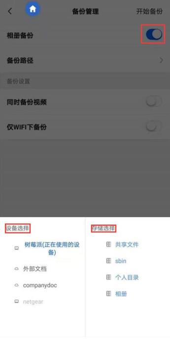

**3.设置好以后，右上角点击“开始备份”即可。**

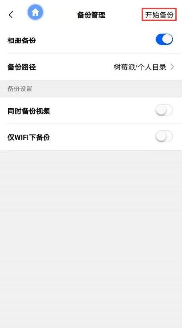

## 远程下载

**开始远程下载之前，确保“我的存储”的设备上已经配置好了Aria2。**

**1.易有云APP首页，“我的存储”找到我已经配置好Aria2的设备，点击进入；**

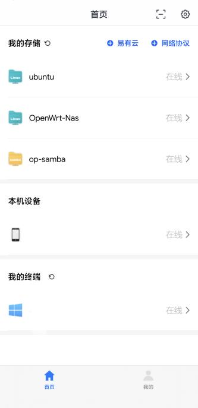

**2.点击“远程下载”；**

**3.第一次进去会提示无法获取Aria2配置，点击手动设置；**

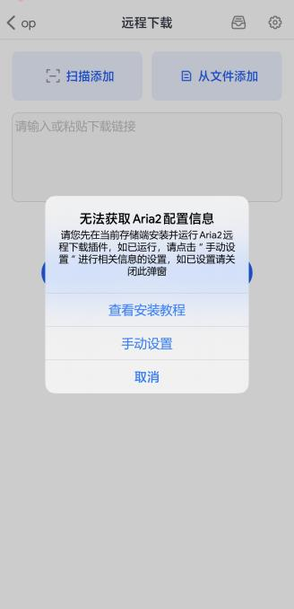

**4.RPC地址填写：http://127.0.0.1:6800/jsonrpc ，RPC密钥填写：你设备上Aria2的RPC令牌；**

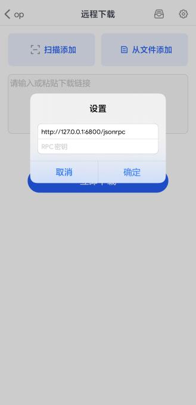

**5.设置完成后，就可以享受远程下载的乐趣了。**

## 视频播放

易有云APP直接播放远端(存储端)的视频：

**1.易有云APP首页，“我的存储”下点存储了视频的设备；**

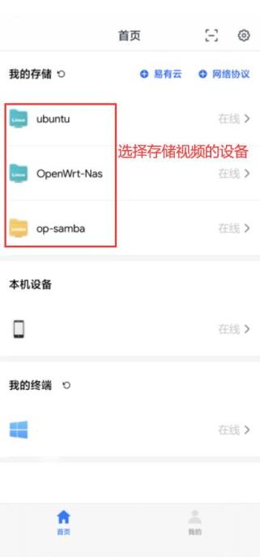

**2.找到视频，点击视频就能播放，若需要加载字幕，字幕和视频放同个文件夹下，会自动加载；**

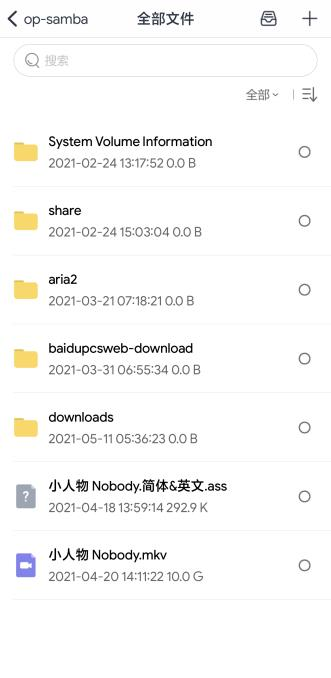

**3.若字幕未自动加载，或者放在别处可以手动选择；**

点击左侧的切换字幕按钮；

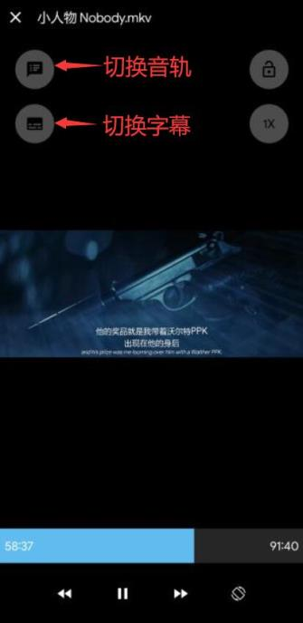

可以切换字幕，也可以点击“外挂字幕”，选择未自动加载的字幕。

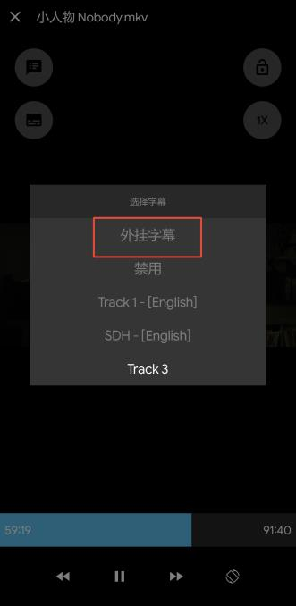

## 微信互传

如何实现文件在微信与易有云之间的互传（iOS）？

### 1.分享

在微信中分享易有云已下载文件

**在操作前，请先在易有云APP里下载需要传输的文件**

**1.在微信聊天窗里点击“+号-文件”；**

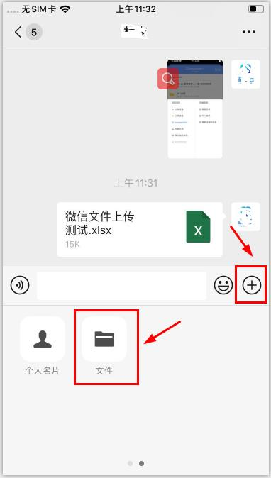

**2.在文件目录选择页面，切换并选中“icloud”；**

**3.在出现的页面中，点击左上角“浏览”，然后点击“我的iPhone”，并点击进入易有云Lite文件列表页面；**

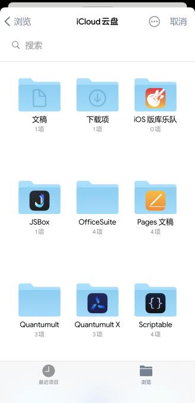

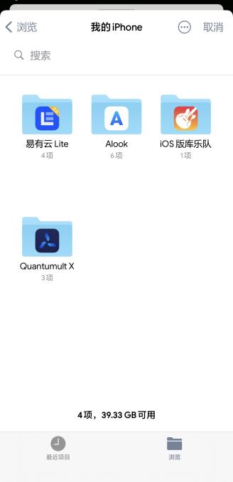

**4.在易有云Lite里的download文件夹中选中要分享的文件后即可分享文件给微信群/好友。**

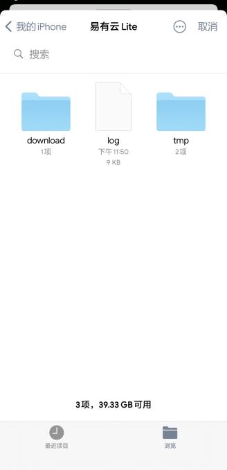

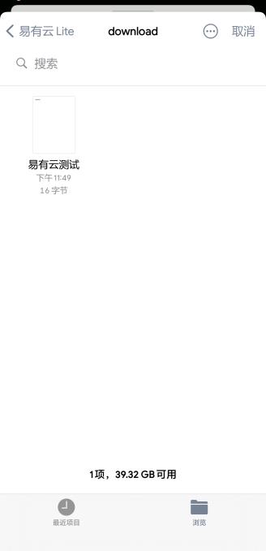

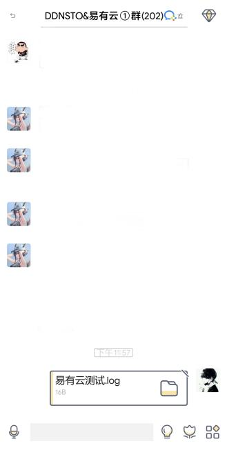

### 2.上传

把微信文件上传至易有云云端保存

*此方式限制文件大小不得超过100M（微信本身限制）

**1.在微信中打开要上传的文件(文件打开，点击右上角，点击“用其他应用打开”)；**

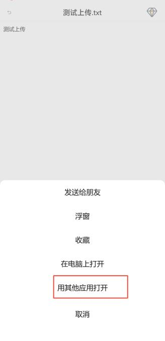

**2.选择“存储到文件”，然后选择路径保存；**

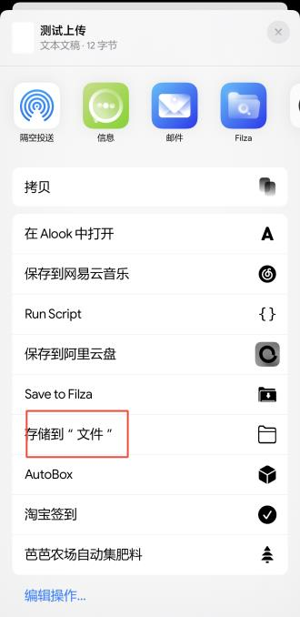

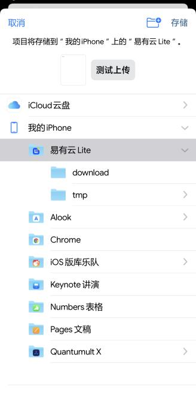

**3.然后打开易有云APP首页，选择“我的存储”的设备；**

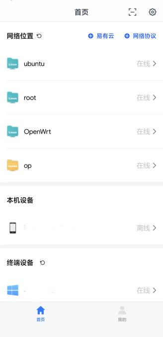

**4.选择要云端保存的设备，打开，选择目录；**

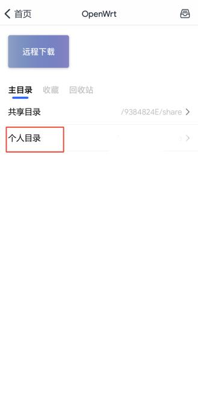

**5.进入目录，点击右上角“+”，选择“本地文件”；**

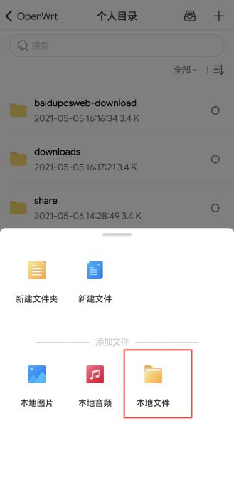

**6.选择之前保存的文件，上传即可，这样文件就保存到云端了。**

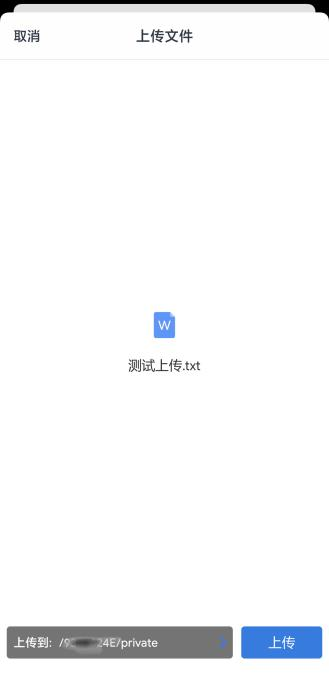

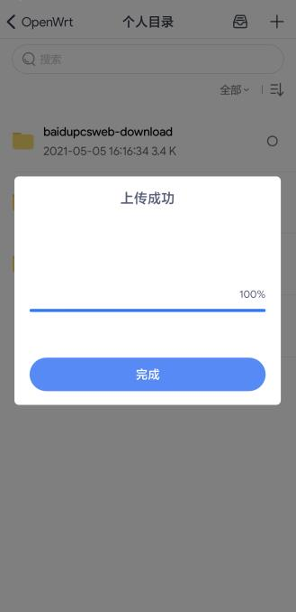

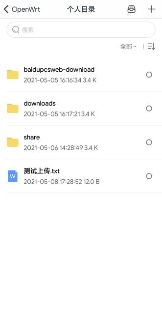

## Samba远程

如何用易有云连接SAMBA远程访问设备文件？
<!-- <blockquote>
<front color="#DC143C">连接前，请手动更新存储端与客户端到最新版本；</front>  -->
连接前，请手动更新存储端与客户端到最新版本；

版本更新：[更新下载](https://www.ddnsto.com/linkease/download/)

**使用场景举例：**

1. 家里路由器安装了易有云 
2. 家里还运行了一台开启了 Samba 服务的设备，且设备上不方便直接安装易有云存储端 
3. 人在公司，需要家里这个 Samba 服务里面的文件

<!-- <blockquote>
<front color="#DC143C"> 已知玩客云、小米硬盘路由不支持，因为他们的 SAMBA 是 1.0 版本，无法支持。目前易有云支持的是 2.x ~ 3.x 版本</front> 
</blockquote> -->
已知玩客云、小米硬盘路由不支持，因为他们的 SAMBA 是 1.0 版本，无法支持。目前易有云支持的是 2.x ~ 3.x 版本

**前期准备：**

1. 路由器正常运行易有云 
2. SAMBA设备正常运行 
3. 手机登录易有云客户端

**绑定流程：**

**1.登录APP，首页点击“+网络协议”，出来弹窗选择“SMB/CIFS”；**

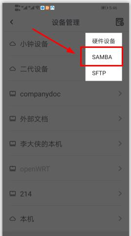

**2.选择关联设备，设备IP为选填项（可选择也可手动输入），建议选择IP，这样数据更准确。**
<!-- <blockquote>
<front color="#DC143C">SAMBA 用户名密码，易有云只存本地客户端，不会存服务器。即使是服务器管理人员，也无法知道密码信息，保证个人数据安全。但就是每个客户端都得单独添加一次。；</front>
</blockquote> -->
SAMBA 用户名密码，易有云只存本地客户端，不会存服务器。即使是服务器管理人员，也无法知道密码信息，保证个人数据安全。但就是每个客户端都得单独添加一次。

**①如果选择了关联设备，那么通信方式如下：**

也就是说，你的本地客户端通过连接关联设备访问到 SAMBA 设备 IP，即在任何外网网络易有云都能保证能连接到 SAMBA。

**②如果不关联设备，那么：**

客户端必须跟 SAMBA 在一个局域网才能访问到 SAMBA 设备。

**选择关联设备，然后“选择ip”，端口默认为445，可更改；**

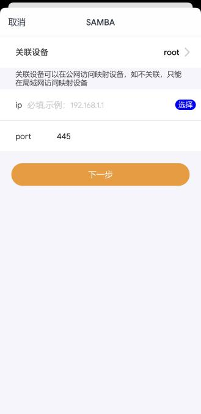

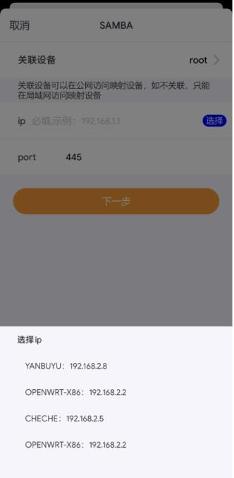

**3.填写SAMBA设备“用户名和密码”；**

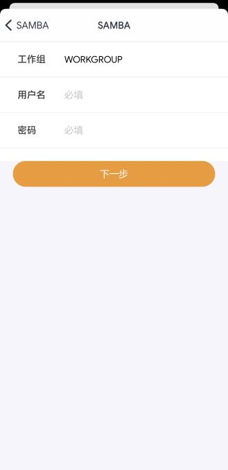

**4.填写SAMBA设备“名称及目标路径”，目标路径为选填项(可选择也可手动输入)，点击绑定；**

<!-- <blockquote>
<front color="#DC143C">目标路径即为您要访问的SAMBA设备的共享目录</front>
</blockquote> -->
目标路径即为您要访问的SAMBA设备的共享目录

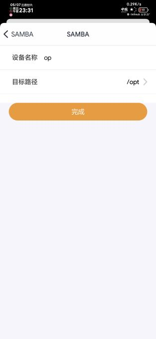

**5.绑定成功后，该虚拟设备出现“首页-我的存储”列表页面，点击此设备，可在该设备的“主目录-全部文件”访问该虚拟设备中的文件。**

<!-- <blockquote>
<front color="#DC143C">SAMBA协议绑定的设备均为虚拟设备，除文件管理外，其他功能均不可用；</front>
</blockquote> -->
SAMBA协议绑定的设备均为虚拟设备，除文件管理外，其他功能均不可用；

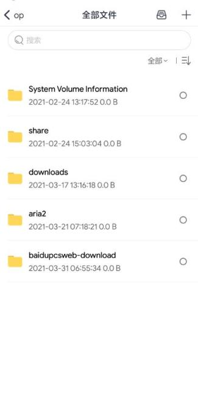

## 目录设置

管理员如何设置设备上的目录？

**1.设备管理员点击首页右上角“齿轮”按钮，进入设备管理页面；**

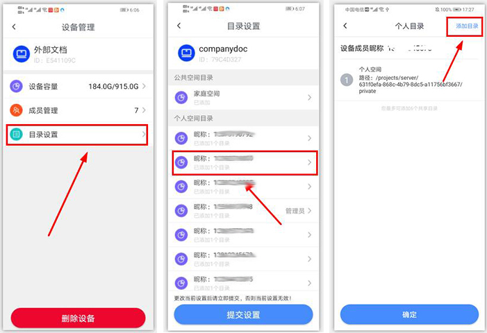

**2.点击设备的“目录设置”，即可进入目录设置页面；**

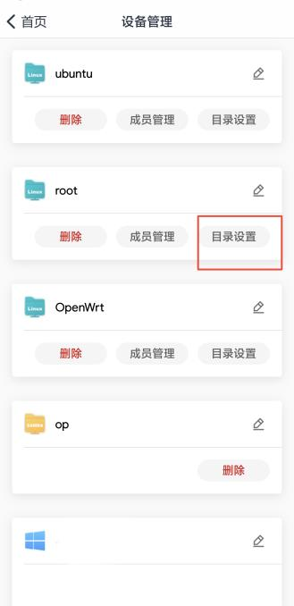

**3.在此页面可进行目录相关“编辑”，编辑好提交设置即可。**

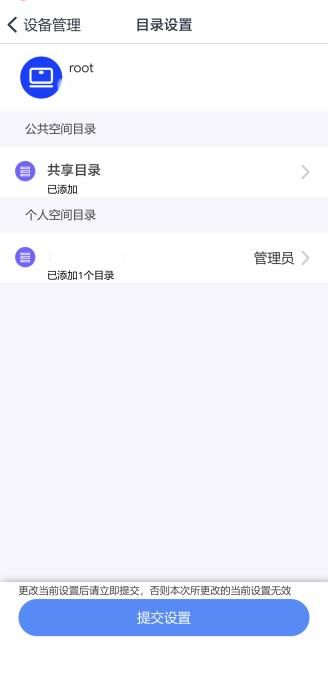

## Web DAV

### 电脑上配置Web DAV？

**1.打开易有云电脑客户端，选择好存储端后，点击工具栏，然后点击网络硬盘；**

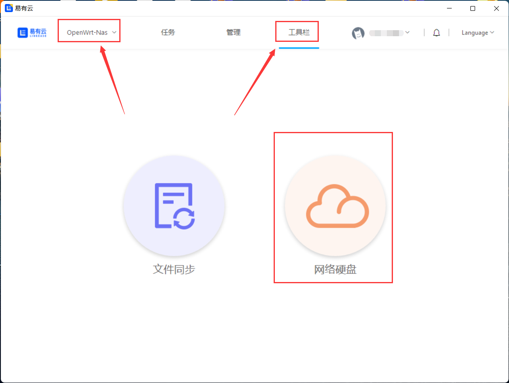

**2.然后服务设置，设置Webdav用户和Webdav密码(设置完成请记住)；**

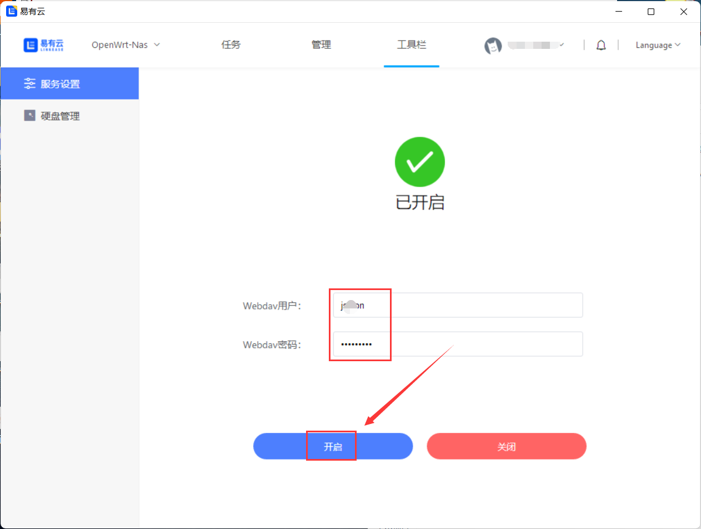

**3.然后磁盘管理，选择目标主机，可以选择盘符映射到本地；**

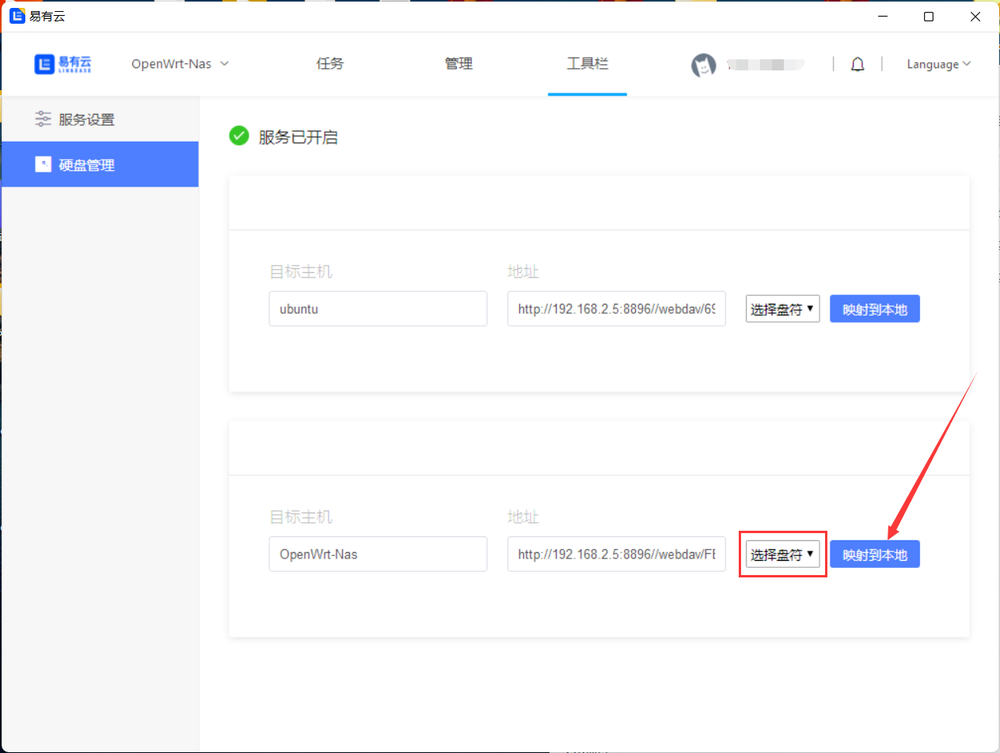

**4.最后打开“此电脑”，就能看到映射的盘，就能点击进去直接访问了。**

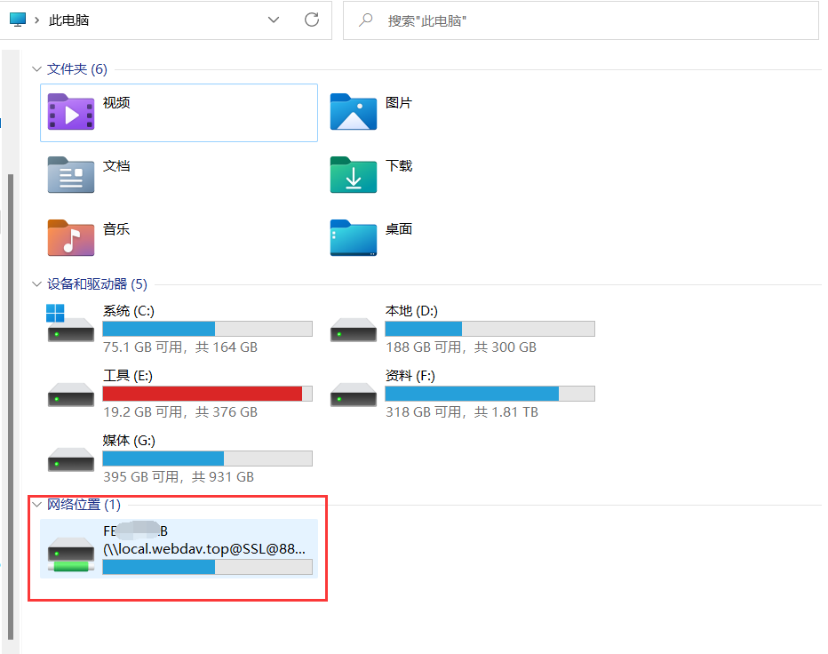

### 手机上配置Web DAV？

**1.在上面第三步的时候，目标主机后，有个地址，我们整个地址复制下来；**

PS：地址类似这种：**http://192.168.2.5:8896//webdav/XXXXXXX**

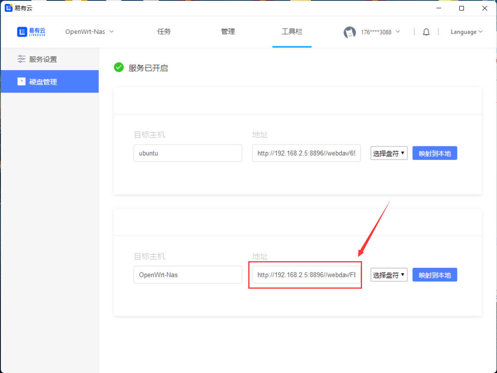

**2.然后打开易有云App，首页——网络协议——Web DAV；**

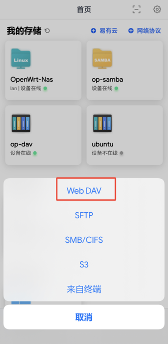

**3.然后选关联设备，把前面复制的地址：http://192.168.2.5:8896//webdav/XXXXXXX 填写到服务器url；**

PS：地址需要特别注意的，在端口后面的//，要去掉一个/，所以正确的url是：**http://192.168.2.5:8896/webdav/XXXXXXX** 

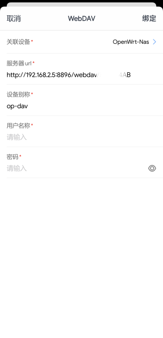

**4.然后设置别称，用户名称是和密码(电脑端设置的Webdav用户和Webdav密码)，填写完成后绑定。**

**5.回到易有云App首页就能看到刚绑定的Web DAV，点击就能访问。**

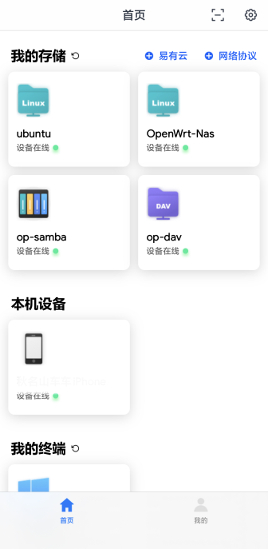

