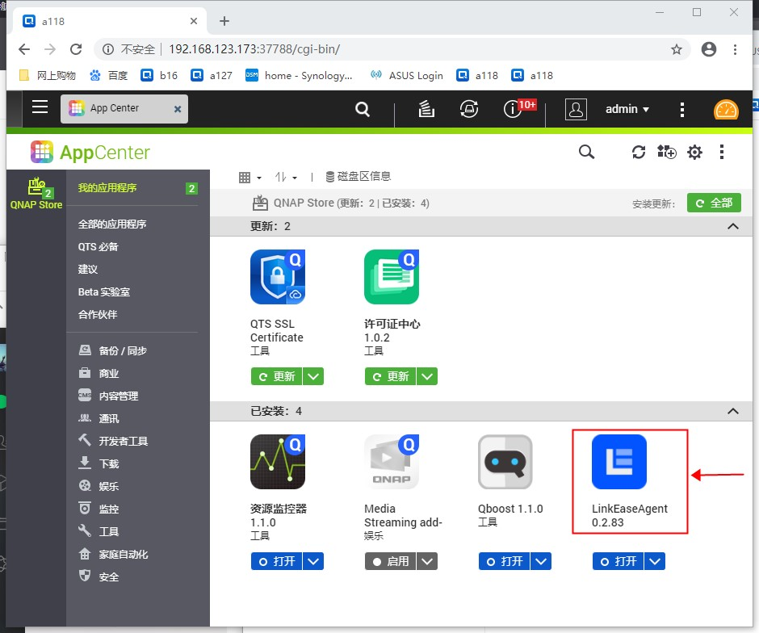
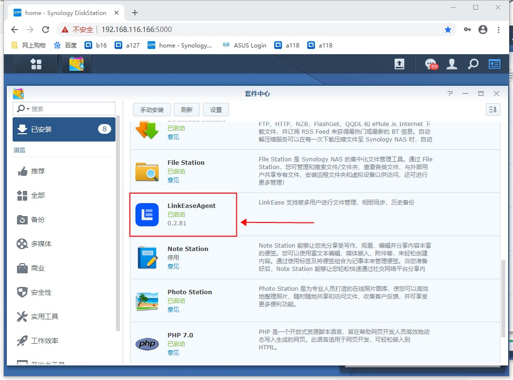
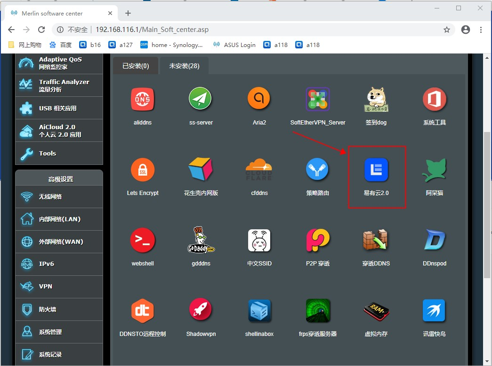
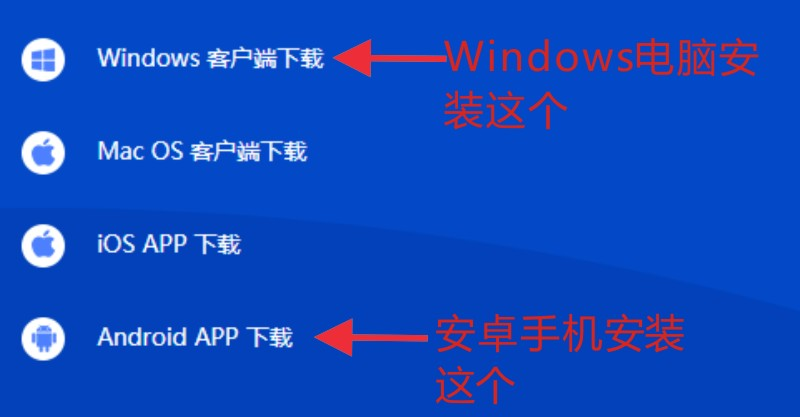

易有云是一款多平台的app。买了NAS的朋友都可以安装。支持威联通，群晖和Linux（ARM），各种路由器。

                                         威联通NAS截图
 

                                         群晖截图

                           梅林固件，openwrt固件和lede固件的路由器       

      
在移动端方面，安卓手机和苹果手机都可以安装易有云，Windows电脑，苹果电脑和linux机都有相应的版本。

下载网址https://www.ddnsto.com/linkease/download/#/，选择对应的版本下载安装即可。非常容易使用。

