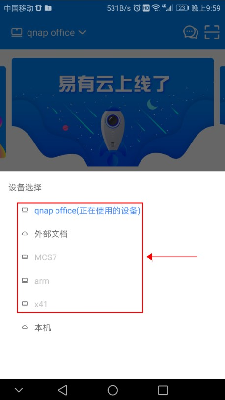
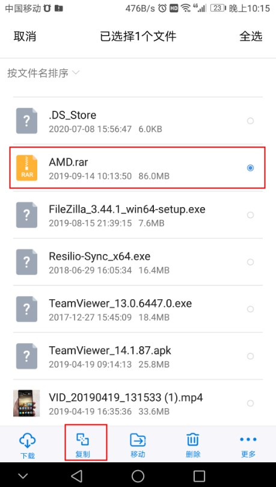
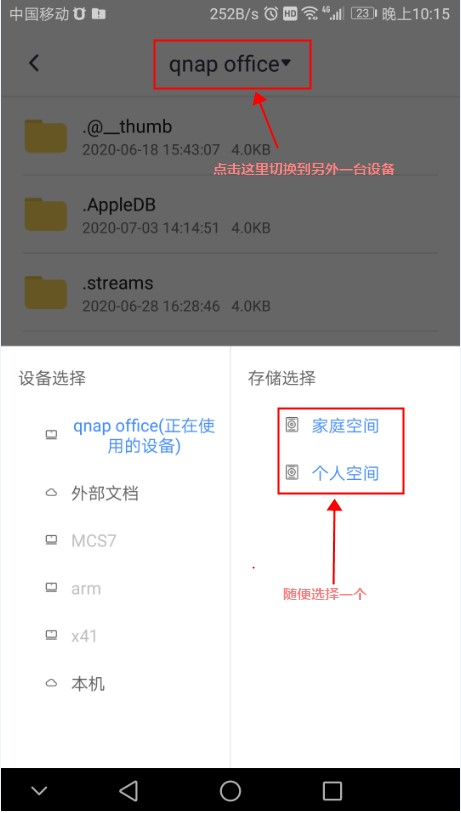
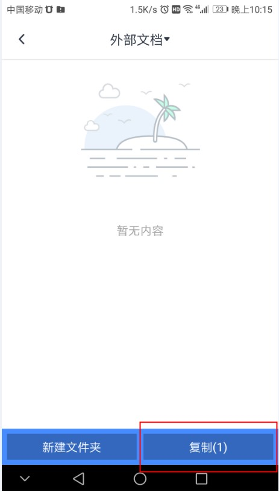

如果用户有多台存储设备，可以都绑定到同一个易有云账号下，方便管理。不限制设备数量，不同NAS平台均可，且可以在不同NAS之间互相复制文件。

绑定设备方法，在NAS上登录易有云账号即可绑定该设备。没有易有云账号可以先注册一个。

绑定多台设备后，切换设备方法，

在弹出的设备列表中选择该设备，

用户有需要，可以在不同NAS之前互相复制文件。

首先选择一个文件，点击下面的复制，

再选择要复制到的设备，

最后选择复制，就开始复制到目的设备了。跨设备传输，非常牛。

