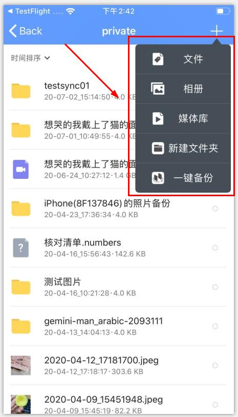
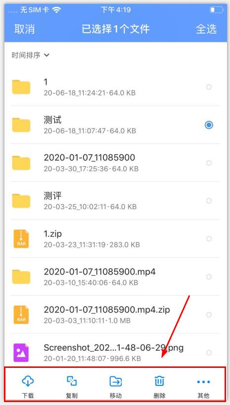
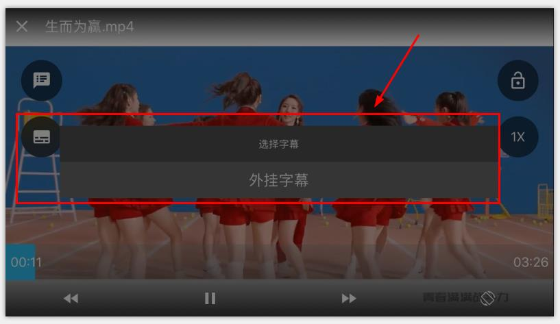
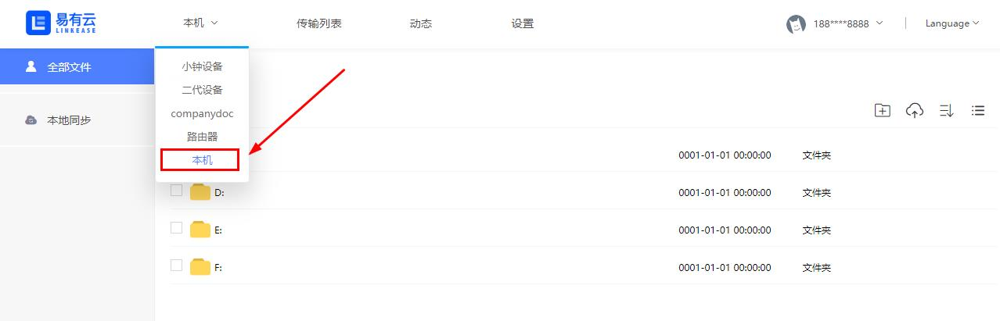
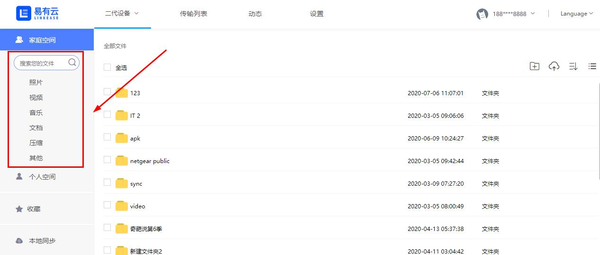

## 功能预览

### 手机（iOS & Android)

**1.首页智能分类**

**2.首页切换设备**

*Android支持切换至手机终端

**3.文件上传**

*一键备份：为一次性即时上传手机所有文件数据

**4.文件管理操作**

**5.压缩包在线解压**

**6.多文件在线压缩**

**7.跨设备传输**

**8.视频倍速播放**

**9.视频外挂字幕**

**10.多人共享设备**

**11.自动备份（iOS）**

**12.微信文件直接上传至易有云设备（iOS）**

**13.可切换至本机终端，管理本机文件，实现终端与设备间文件互转（Android）**

### PC (MacOS & Windows)

**1.首页智能分类**

**2.可切换至本机终端，管理本机文件，实现终端与设备间文件互转**

**3.终端与设备文件同步，可设置单向/双向同步**

**4.多类型设备绑定**

**5.开启本机电脑作为存储端设备，绑定后，可远程访问**

**6.在线创建、编辑Markdown文档，生成Html**

### 电视（TV版本敬请期待！！）
