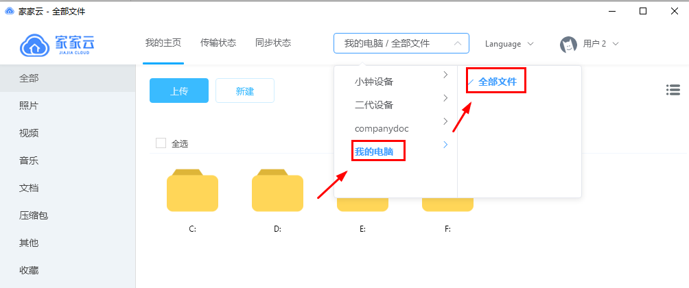
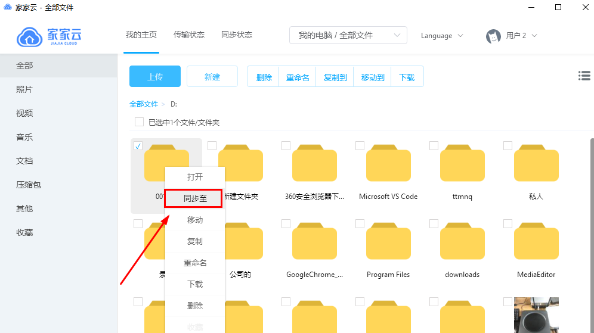
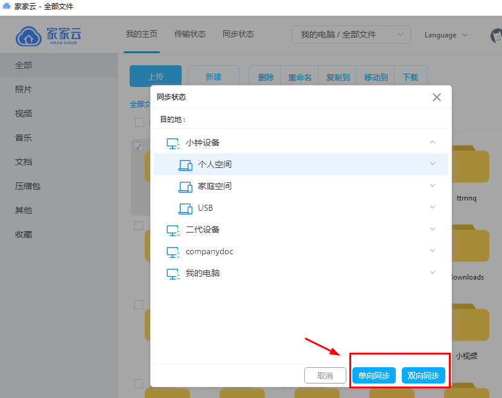

# 同步文件

目前，PC客户端支持同步文件功能。同步方式有两种，可以根据个人需求选择。
单向同步：在本地同步文件夹中对文件进行操作（创建、修改、删除、改名、移动）后，将会同步更新到云端，但在云端更改同步文件则不会同步到本地；
双向同步：本地和云端实时同步，一端有变化会同步更新到另一端，同步文件夹中本地文件与云端文件始终保持一致。

设置同步文件操作如下：
（1）	点击“我的电脑-全部文件”

 

（2）	选择我们想要同步的文件夹（单个文件不可同步），点击鼠标右键选择“同步至”

（3）	选择要同步至的目的设备空间，点击单向同步或双向同步即可

 

