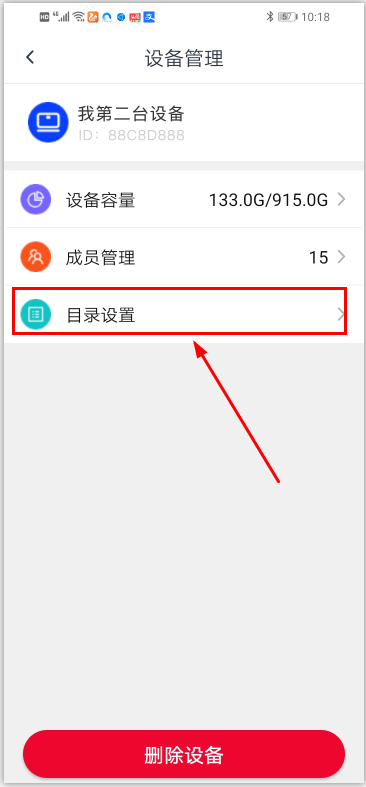
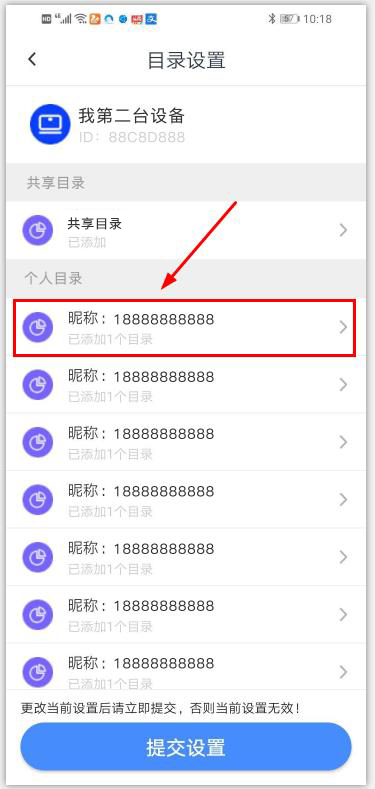
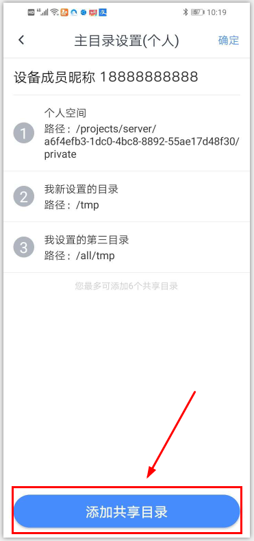
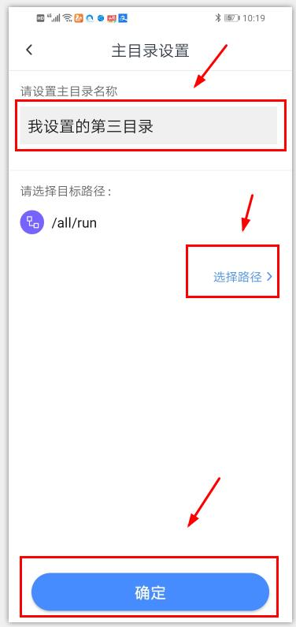
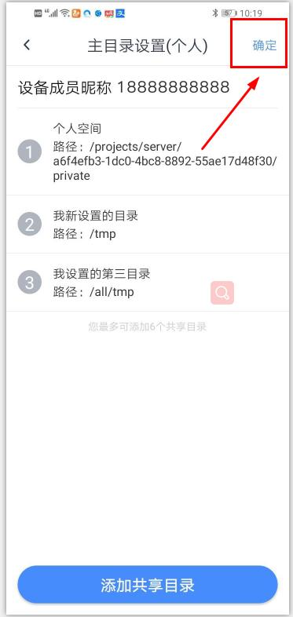
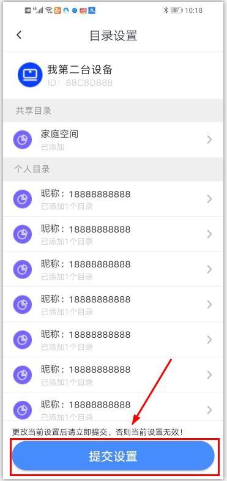

# 管理员如何设置用户目录（Android）？
**成员共享设备时，默认生成一个“个人目录”及一个“共享目录”（包含设备管理员）。其中个人目录为设备成员的私人目录，只对该成员本人可见；“共享目录”对设备所有成员可见，开放所有权限；**

**1.登录APP，点击“我的-设备管理”，进入具体的设备管理页面。点击“目录设置”，进入设备成员目录设置界面；**

**2.点击具体成员列表，进入该成员的个人目录设置界面（共享目录为唯一目录，管理员直接点击便可设置目录）；**

**3.点击“添加目录”，进入添加成员个人目录列表界面；**

**4.设置好用户目录名称及路径，点击“确定”，即跳转至目录列表页面；**

**5.点击"确定"，即跳转至设备成员目录设置页面；**
*目录设置支持单次批量操作，如您想继续添加用户个人目录，请重复步骤2-5；

**6.确认本次操作已完成后，请务必在设备成员目录设置页面点击“提交设置”，否则此次更改无效！！！！**

**7.更改完成后，所更改目录的用户即可在“文件”页面查看该目录路径下所有文件。**