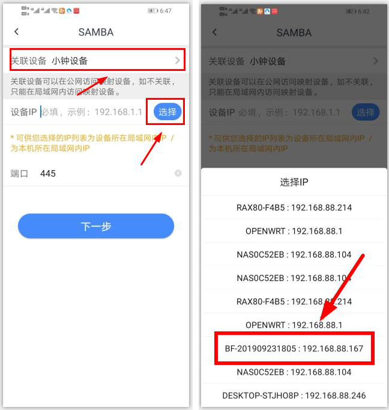
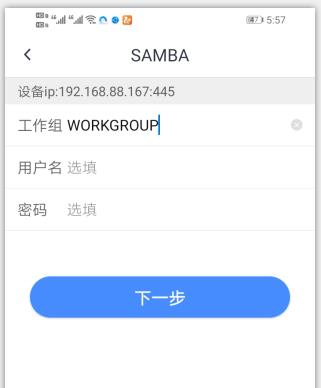
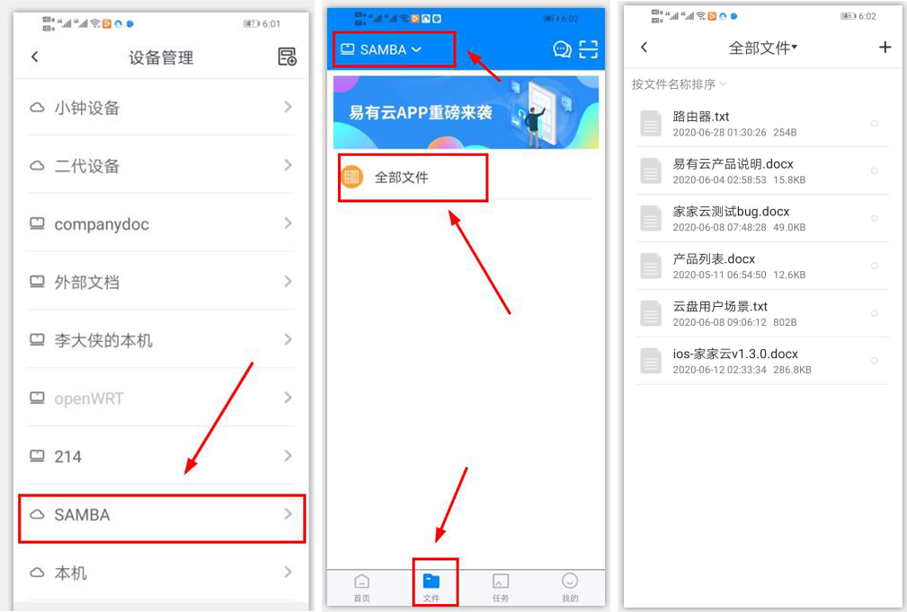

# 如何用易有云连接SAMBA远程访问设备文件？
<blockquote>
连接前，请手动更新存储端与客户端到最新版本；

版本更新： [https://www.ddnsto.com/linkease/download/#/](https://www.ddnsto.com/linkease/download/#/)
</blockquote>

**1.登录APP，点击“我的-设备管理”，进入设备列表页面。点击右上角添加设备图标，选择SAMBA；**

**2.选择关联设备，设备IP为选填项（可选择也可手动输入），建议选择IP，这样数据更准确。**
<blockquote>
SAMBA 用户名密码，易有云只存本地客户端，不会存服务器。即使是服务器管理人员，也无法知道密码信息，保证个人数据安全。但就是每个客户端都得单独添加一次。；
</blockquote>

**①如果选择了关联设备，那么通信方式如下：**

也就是说，你的本地客户端通过连接关联设备访问到 SAMBA 设备 IP，即在任何外网网络易有云都能保证能连接到 SAMBA。

**②如果不关联设备，那么：**

客户端必须跟 SAMBA 在一个局域网才能访问到 SAMBA 设备。

**端口默认为445，可更改。点击下一步；**

**3.填写工作组，我的win10电脑用户名和密码，点击下一步；**

**4.填写设备名称及目标路径，目标路径为选填项（可选择也可手动输入），点击绑定；**

**5.绑定成功后，该虚拟设备出现在“我的-设备管理”列表页面。您可在“文件”页面访问该虚拟设备中的文件；**
<blockquote>

SAMBA协议绑定的设备均为虚拟设备，除文件管理外，其他功能均不可用；

</blockquote>
