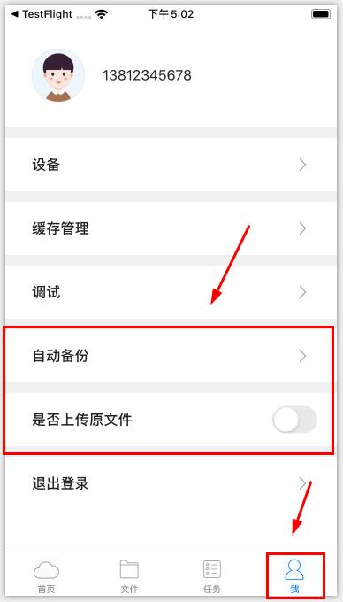
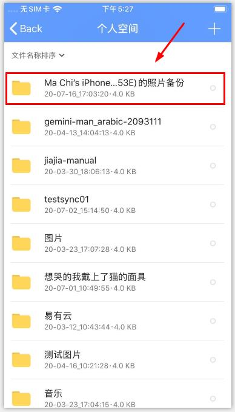

# 一键备份与自动备份有什么区别？

**1）一键备份：为即时性和一次性操作；**

登录APP后在“文件-个人空间”页面，点击右上角按钮“＋”，选择一键备份，系统会即时备份手机文件。

**2)自动备份（ios）：持续性操作**

在IOS设备上点击“我的-自动备份”，选择好备份位置，系统即可后台持续备份手机文件。 如需上传原画级别，请开启“上传原文件”。

**3）备份默认将文件备份到个人空间，备份完成后会以“手机名称＋照片备份”来命名的文件夹呈现。**

备份时，系统会自动识别手机文件，且按照手机型号与文件日期自动去重。

