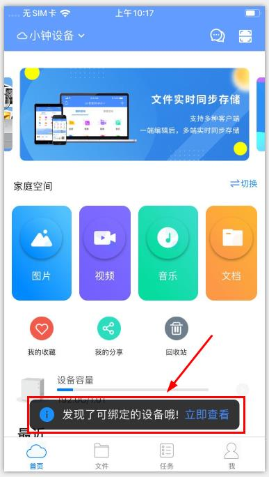
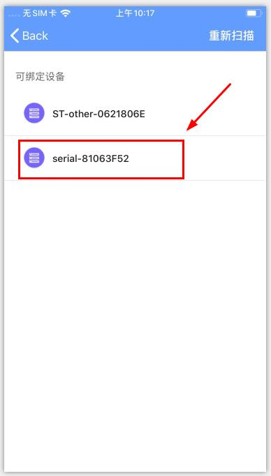
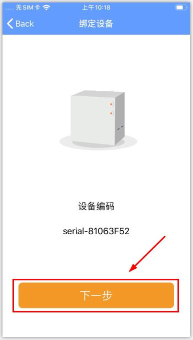
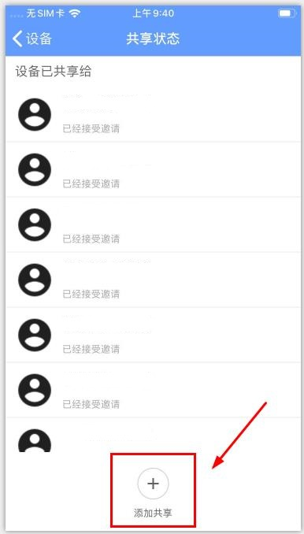
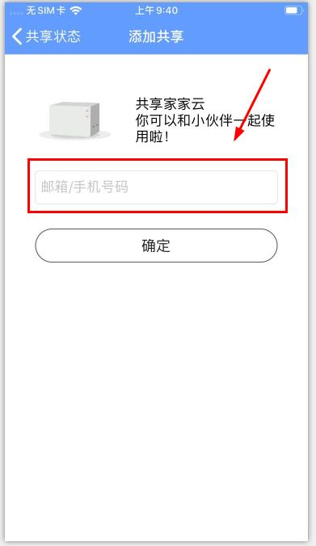
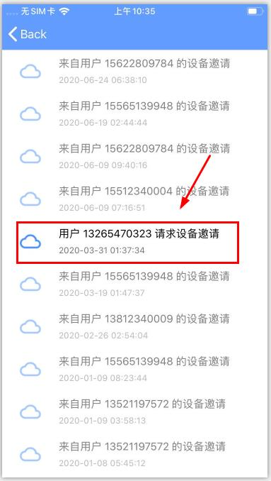
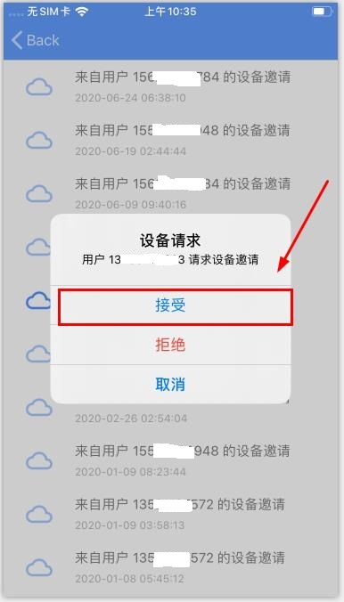

# 管理员如何绑定和共享设备？

### 1）绑定设备：开启手机Wi-fi，并确保您的手机与要绑定的设备在同一路由器网络下

**1.打开手机App，系统会自动扫描局域网内可绑定设备，点击进入搜索的设备列表页面；**

*您也可以点击“我的-设备-添加设备”，通过扫描设备二维码等其他方式绑定设备。

**2.点击要绑定的设备，进入绑定设备确认页面；**

**3.点击“下一步”，进入设备初始设置页面；**

**4.根据页面提示设置好“设备名称”及“初始路径”，点击“确定”按钮即可绑定设备；**

 ***首位用户绑定设备后成为该设备的管理员，一个设备只能有一个管理员。** 

### 2）共享设备
 只有管理员才能主动分享设备，每台设备最多可邀请19位成员共享。 

**1.设备管理员在“我的-设备”列表页面（iOS），点击要分享的设备，进入设备共享成员列表页面。点击“添加共享”，输入要添加的成员手机号码后点击确定即可；**
*安卓用户请点击“我的-设备管理-进入设备-设备成员”，进入成员列表页面进行相应操作；

**2.受邀成员在app“首页-消息”中接受设备邀请即可共享该设备。**

