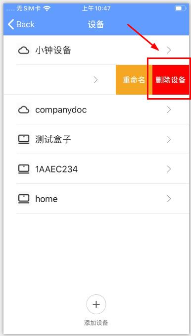
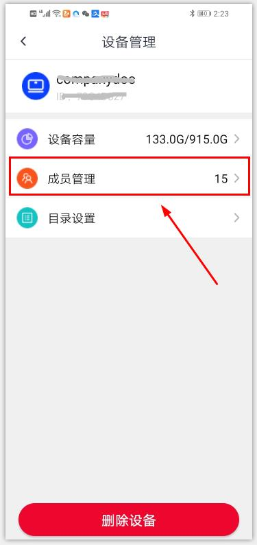

# 如何解绑和取消共享？
登录app后，点击“我的-设备”，进入设备列表页面。左滑要删除的设备，点击“删除设备”即可（ios）。为保障用户的数据安全，如管理员想删除自己的设备，需先取消所有设备共享成员方可删除。
*安卓用户可点击“我的-设备管理-进入设备”，在设备详情页面点击“删除设备”即可。

如管理员想要取消他人共享，点击设备，进入该设备共享成员列表页面，左滑要取消的用户，点击“取消共享”即可。

*安卓用户可点击“我的-设备管理”点击具体设备，在设备详情页面点击“成员管理”，进入成员列表页面进行相应操作即可。

 ***设备删除和取消共享后，将会删除该用户在这台设备上的所有个人空间数据，且无法找回，请谨慎操作！** 