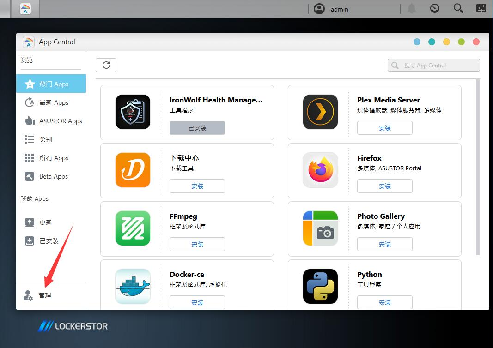
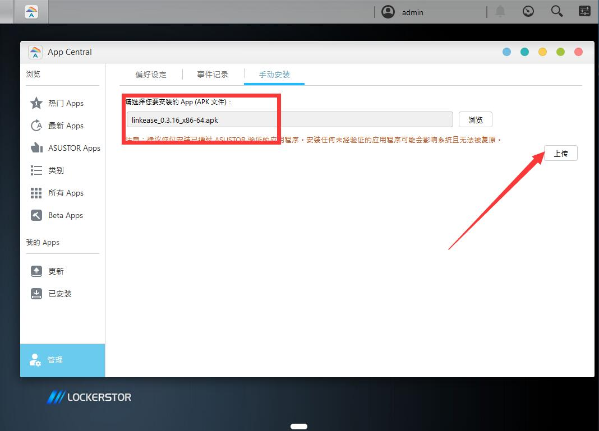
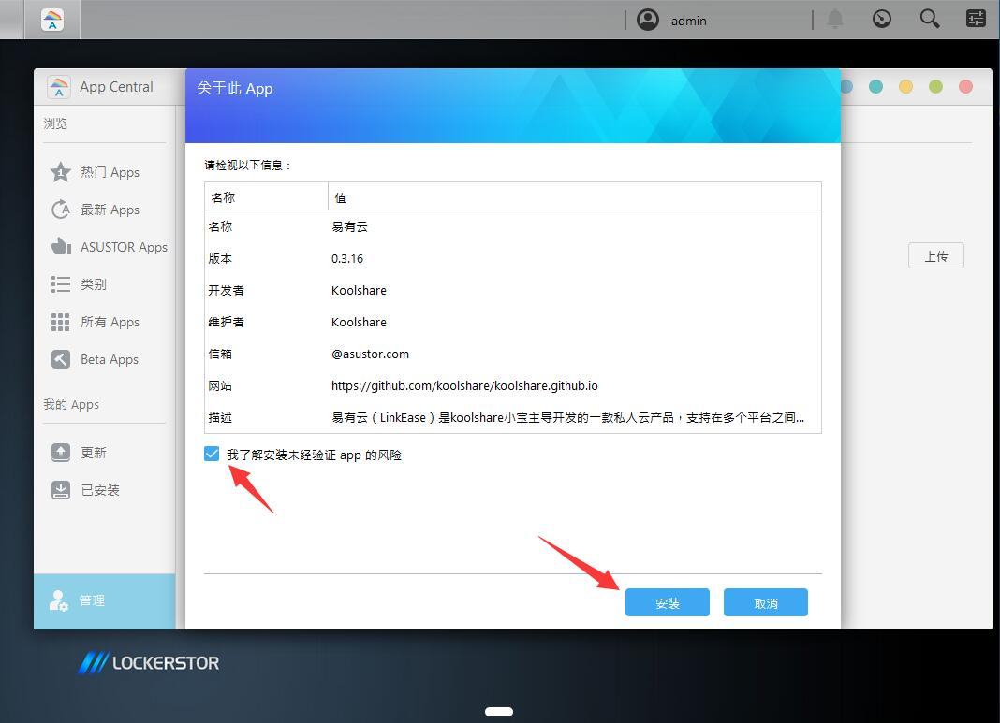

# 在华硕NAS上安装易有云
[存储端下载链接](https://firmware.koolshare.cn/binary/LinkEase/Asus-Nas/)

**1.首先，下载易有云APK。访问NAS主页面，打开华硕`App Central`：**

**2.然后，点击`管理`菜单选项，选择`手动安装`选项卡。点击`浏览`按钮，选择下载好的APK文件**

**3.点击`上传`按钮，上传插件，等待华硕检查完成。勾选`我了解安装未经验证的app的风险`并点击`安装`，等待安装完成。**

**4.安装完毕后，框内是插件开关，打开后会启动插件，点击红色箭头处的按钮，即可访问易有云界面。**

[**5.安装后第一次打开，需要绑定设备。点击此处，进入易有云软件统一绑定教程**](/zh-cn/tutorial/NAS/BindingSoftware.md)

