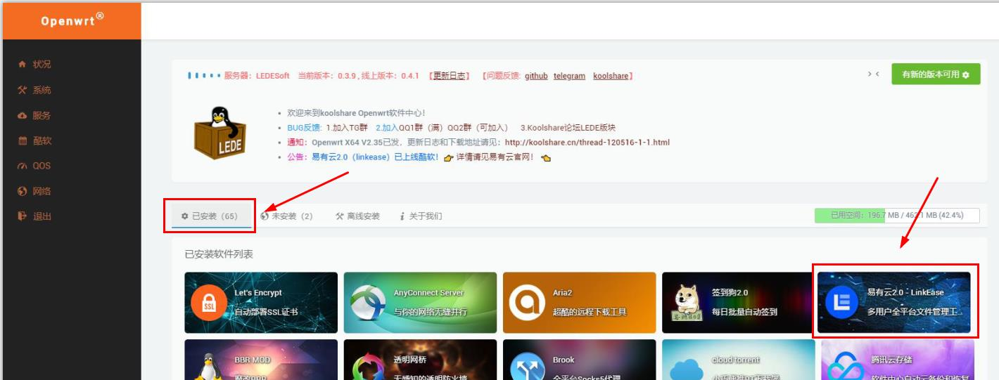
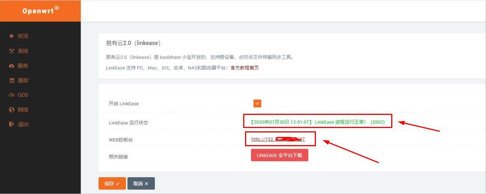

# Koolshare Lede 
*绑定设备前，请确保您已在路由器端接入容量不小于16GB的存储设备，如U盘，移动硬盘等；

**1.登录设备固件管理端，点击“酷软”，进入软件中心页面。点击“未安装”，进入未安装的插件页面；选中“易有云2.0”，点击“安装”，安装易有云插件；**

*易有云1.0和易有云2.0为2个不同插件，安装时，请确认安装的为易有云2.0；

**2.安装完成后，在“已安装”页面找到易有云2.0插件，单击打开；**

**3.勾选“开启LinkEase”，点击“保存”，开启运行易有云2.0；**

**4.确认易有云进程正常开启后，点击“WEB控制台”一栏右侧网址，进入易有云2.0向导页面；**

[**5.点击此处，进入易有云软件统一绑定教程**](/zh-cn/tutorial/NAS/BindingSoftware.md)