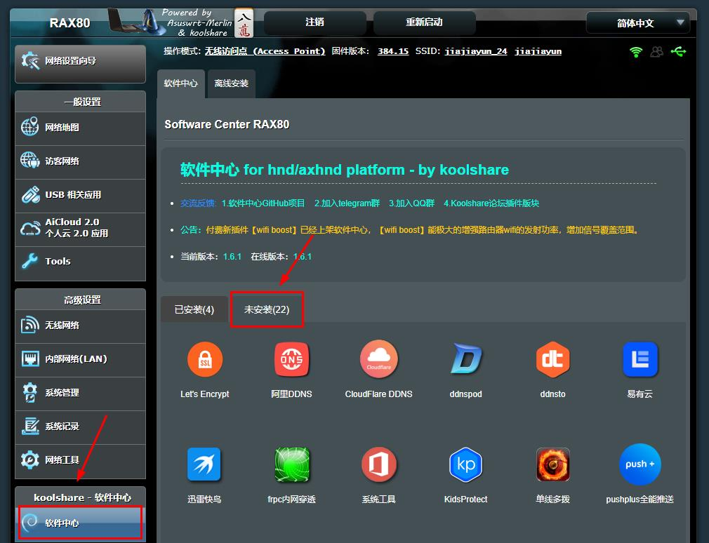
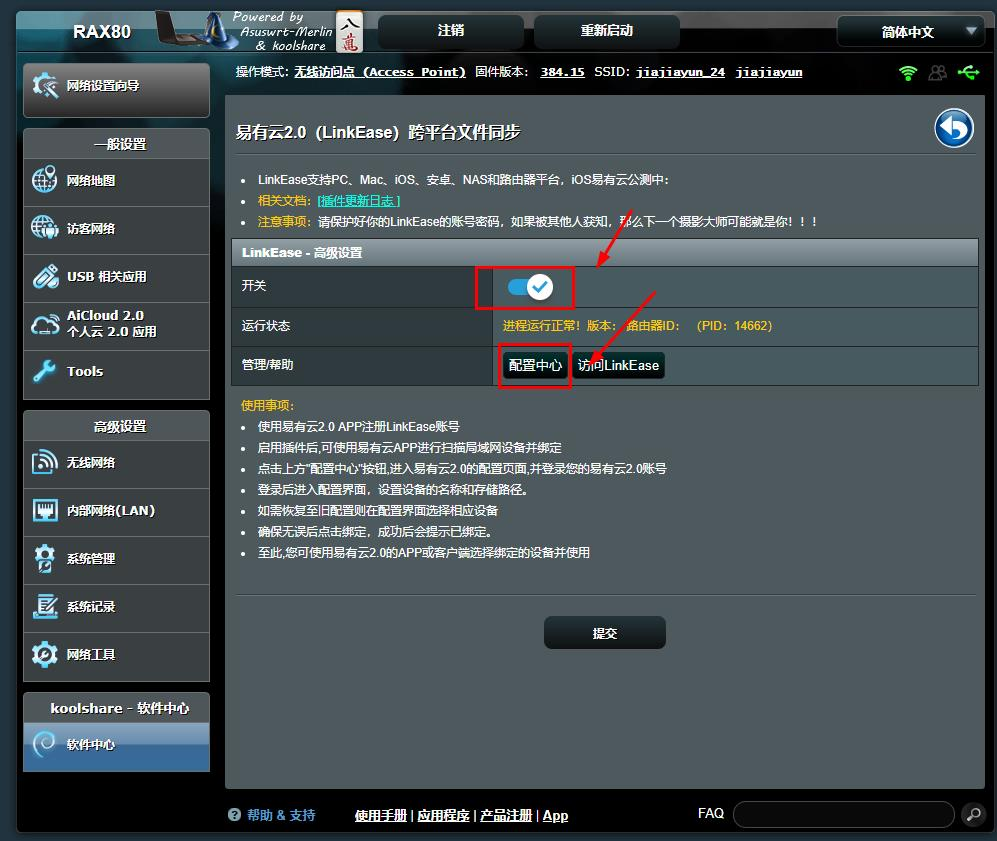
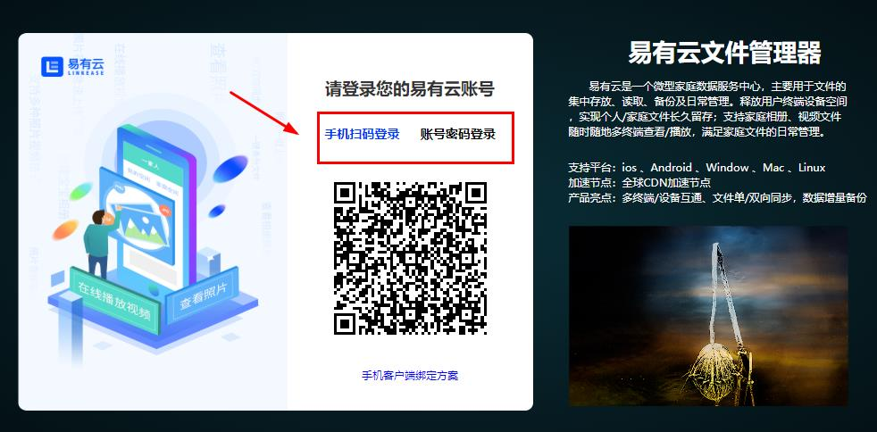
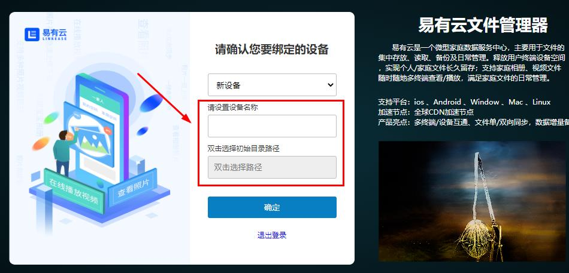
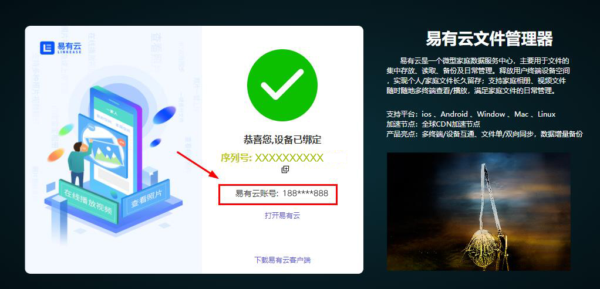

**Koolshare Merlin （ 以NETGEAR RAX80为例）**

 [存储端下载](/zh-cn/android-tv/TODO)

**1.登录NETGEAR RAX80固件管理端，点击“软件中心”，进入软件中心页面。点击“未安装”，进入未安装的插件页面；**

**2.选中“易有云2.0”，点击“安装”，安装易有云插件；**

**3.安装完成后，在“已安装”页面找到易有云2.0插件，单击打开；**

**4.调整开关状态为“开启”，点击“配置中心”，进入易有云2.0向导页面；**

**5.在易有云2.0向导页面登录客户端；**

 ①方式一：打开手机易有云，扫描登录二维码登录； 
 ②方式二：输入您所注册的易有云账号密码进行登录；

**6.登录后，进入设备初始设置页面，设置设备名称及初始目录路径；**

**7.操作成功后，即可在易有云2.0客户端使用该账号管理设备文件；**

*易有云存储端与客户端一一对应，绑定成功后，每次在存储端登录时，需登录此账。否则，在该存储端的向导页面将无法登录；