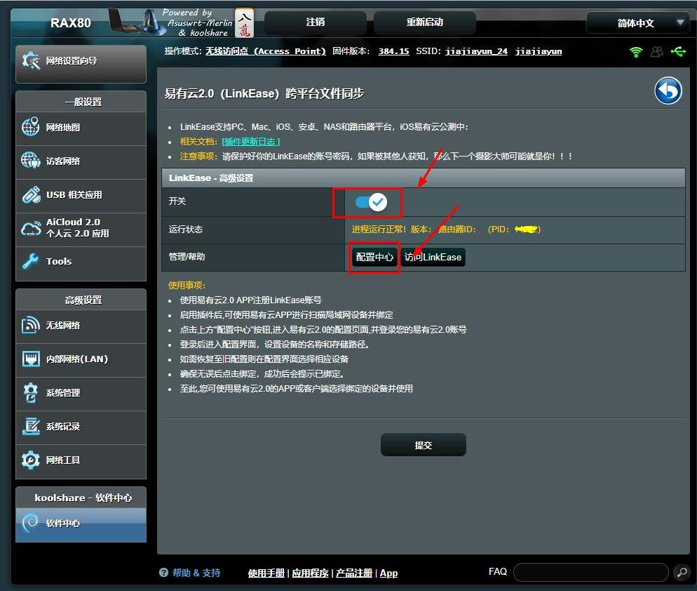

# Koolshare Merlin （ 以NETGEAR RAX80为例）
*绑定设备前，请确保您已在路由器端接入容量不小于16GB的存储设备，如U盘，移动硬盘等；

**1.登录NETGEAR RAX80固件管理端，点击“软件中心”，进入软件中心页面。点击“未安装”，进入未安装的插件页面；**

**2.选中“易有云2.0”，点击“安装”，安装易有云插件；**

**3.安装完成后，在“已安装”页面找到易有云2.0插件，单击打开；**

**4.调整开关状态为“开启”，点击“配置中心”，进入易有云2.0向导页面；**

[**5.点击此处，进入易有云软件统一绑定教程**](/zh-cn/tutorial/NAS/BindingSoftware.md)