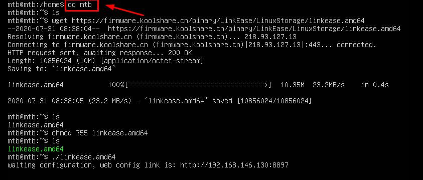
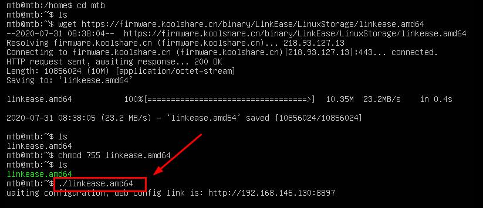

# Linux 通用版
[存储端下载链接](https://firmware.koolshare.cn/binary/LinkEase/Synology/)

**1.首先在命令窗口中登录您的linux系统**
以下按照我本机上的文件目录作为解说： 

**2.在光标后输入“cd mtb” ，点击回车，进入mtb目录中（mtb为您下载文件后存放的目标目录）。输入“ls”确认；**
 <table><tr><td bgcolor=#bae2fe>cd mtb</td></tr></table>

**3.在光标后输入"wget 存储端链接"，点击回车，下载易有云存储端。输入“ls”确认；**
 <table><tr><td bgcolor=#bae2fe>wget 
https:/ / firmware.koolshare.cn/binary/LinkEase/LinuxStorage/linkease.amd64</td></tr></table>

以上网址为易有云linux通用版存储端链接，后期有可能会更改，请您随时关注更新； 

**如何获取易有云linux存储端链接**

点击[存储端下载链接](https://firmware.koolshare.cn/binary/LinkEase/Synology/)，打开易有云存储端下载链接。右键“linkease.amd64”文件，在出现的弹窗中单击“复制链接地址”，即可复制该存储端链接。

**4.在光标后输入“chmod 755 linkease.amd64”给予软件运行权限。输入“ls”确认；**
<table><tr><td bgcolor=#bae2fe>chmod 755 linkease.amd64</td></tr></table>

**5.在光标后输入“./linkease.amd64”，点击回车，运行软件；**
<table><tr><td bgcolor=#bae2fe>./linkease.amd64</td></tr></table>

**6.复制命令窗中出现的网址在浏览器中打开，即可进入易有云向导页面**

[**7.点击此处，进入易有云软件统一绑定教程**](/zh-cn/tutorial/NAS/BindingSoftware.md)

