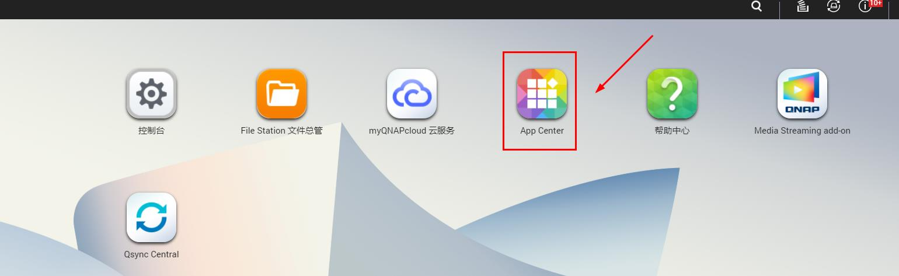

# QNAP(以Win10系统为例)

**1.点击“ [存储端下载](https://firmware.koolshare.cn/binary/LinkEase/QNAP/)”，下载QNAP插件，此处选择"LinkEaseAgent_0.2.83_x86_64.qpkg"；**

*请根据自己电脑上的CPU型号选择相对应的存储端 

**2.登录QNAP操作系统，点击"APP Center"，在出现的APP Center弹窗上点击“安装软件图标”；**

**3.选择已下载的插件上传，按照指示步骤完成插件安装；**

**4.插件安装完成后，点击APP Center弹窗上出现的“易有云”或主页面上的“易有云”均可进入易有云向导页面；**

[**5.安装后第一次打开，需要绑定设备。点击此处，进入易有云软件统一绑定教程**](/zh-cn/tutorial/NAS/BindingSoftware.md)