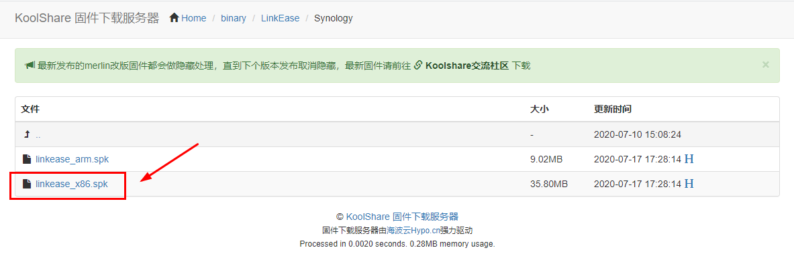
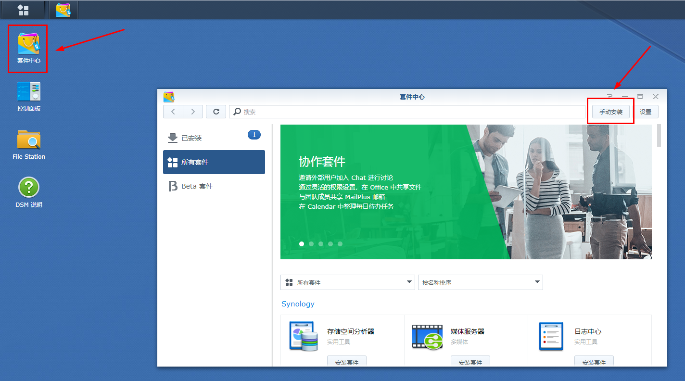
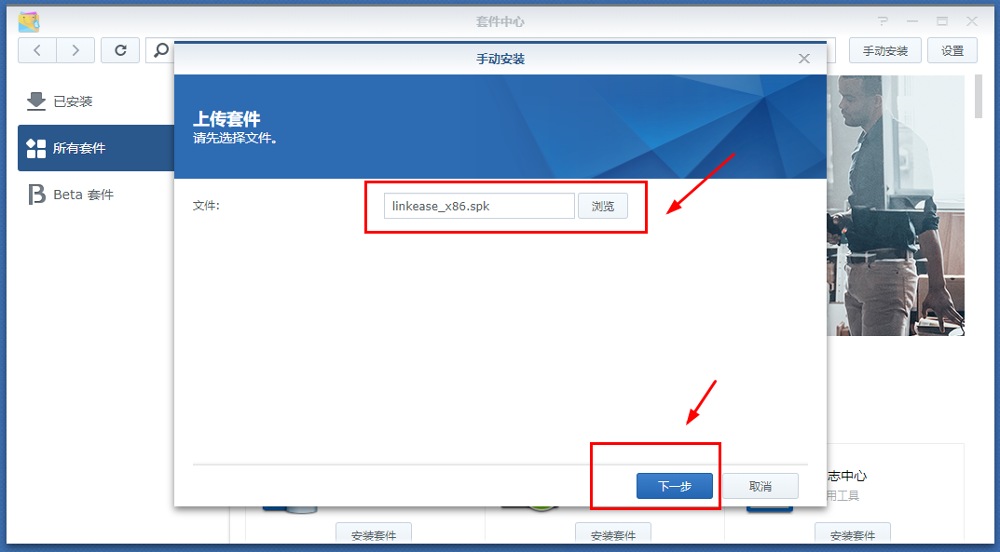
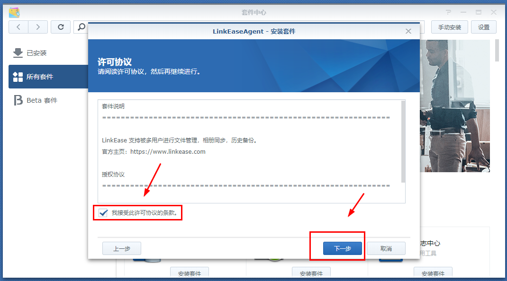
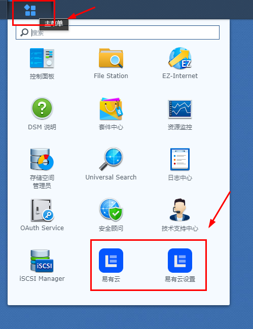

# Synology(以Win10系统为例)

**1.点击“ [存储端下载](https://firmware.koolshare.cn/binary/LinkEase/Synology/)”，下载Synology插件，此处选择"X86"；**

**2.登录群晖操作系统，点击套件中心，在出现的套件中心弹窗上点击“手动安装”；**

**3.选择已下载的插件上传，按照指示步骤完成插件安装；**

**4.插件安装完成后，点击群晖系统左上角“主菜单”，在出现的主菜单页面点击“易有云”或“易有云设置”均可进入易有云向导页面；**

[**5.点击此处，进入易有云软件统一绑定教程**](/zh-cn/tutorial/NAS/BindingSoftware.md)