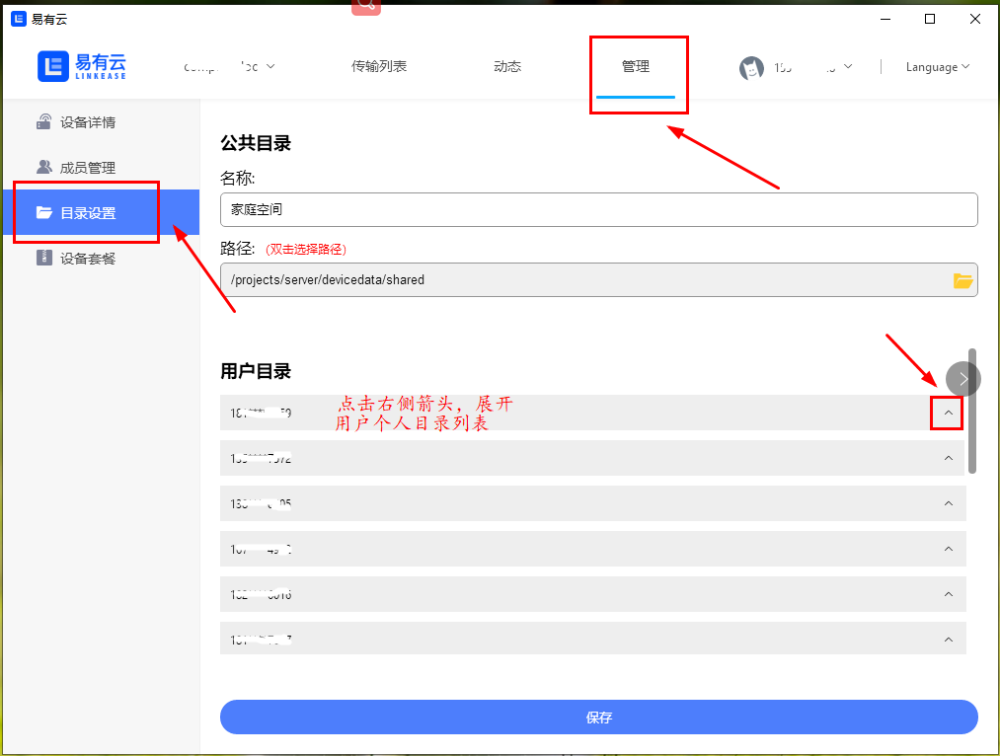
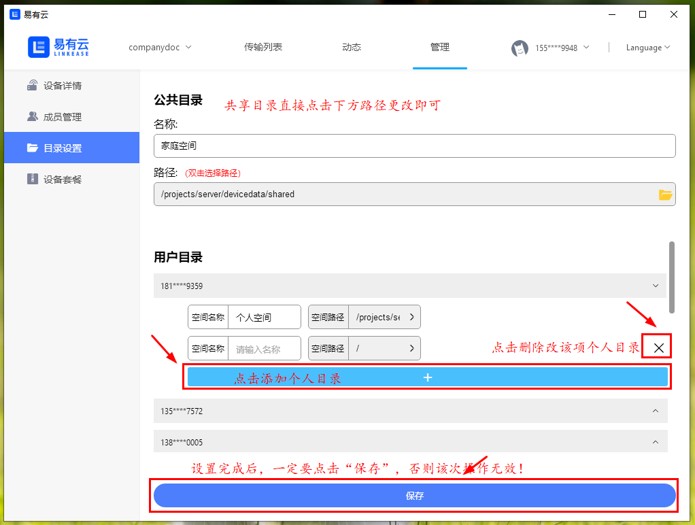

# 管理员如何设置用户目录？
*成员共享设备时，默认生成一个“个人目录”及一个“共享目录”（包含设备管理员）。其中个人目录为设备成员的私人目录，只对该成员本人可见；“共享目录”对设备所有成员可见，开放所有权限；

**1.登录pc客户端，点击“管理-目录设置”，进入设备成员目录设置界面。点击用户列表右方图标，即可展开该用户个人目录列表；**

**2.点击“＋”添加目录按钮，则在该用户下添加一条新的个人目录，设置好目录名称及目录路径后，点击“保存”即可。如您想删除该项目录，点击该目录右侧的“×”删除按钮即可。**

**3.更改完成后，所更改目录的用户即可查看该目录路径下所有文件。**