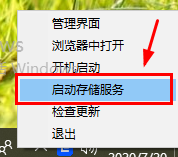
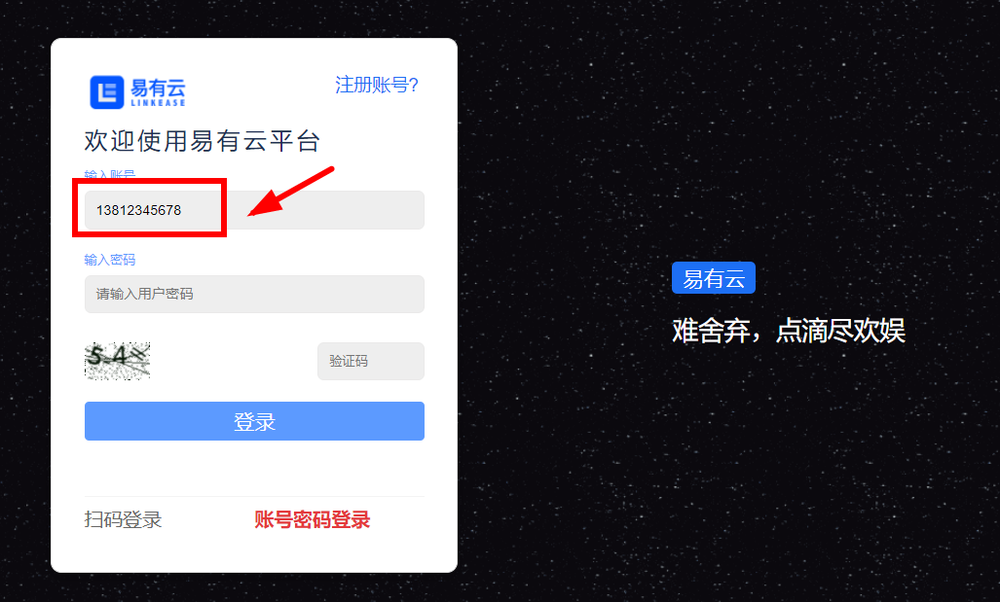
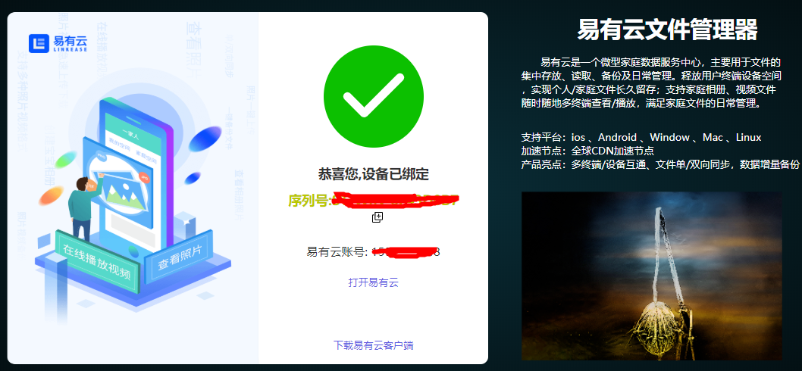

# 如何将本地电脑作为存储端设备绑定（以Windows为例）？
**1.请先安装易有云客户端，并正常开启运行。右键单击任务栏中易有云logo，即可出现客户端易有云菜单栏；**

**2.点击“启动存储服务”，即可打开易有云向导页面（网页）；**

**3.登录易有云，进入设备初始设置页面；**

*登录时，请使用客户端登录账号，否则无法绑定！

**4.设置好名称及初始目录路径后，点击"确定"即可绑定！**

*初始目录路径为用户电脑本机上的任一文件夹路径；

**4.绑定完成后，即可将本机作为存储端设备远程管理访问数据！**

