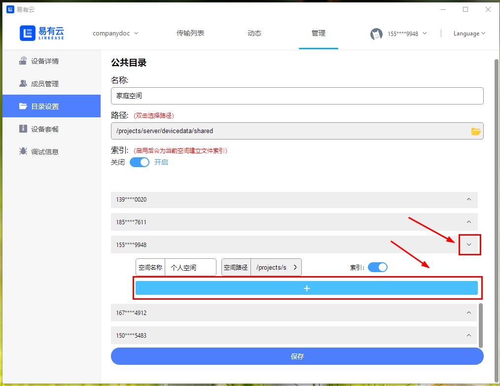
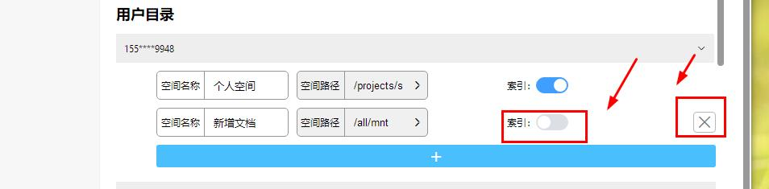

# 管理员如何设置设备上的用户目录？

**设备管理员点击“管理-目录设置”，进入设备目录设置页面**

**1.设置共享目录/家庭空间：在设备目录设置页面，公共目录板块直接更改目录路径和设置索引即可（共享目录名称不可更改）；**
<blockquote>
<strong>每个主目录都可以分别设置索引，默认是关闭的。手动开启索引后，即可支持文件智能分类及搜索功能，但占用的CPU会比较高；</strong>
</blockquote>

**2.设置个人目录/个人空间：点击成员列表右侧的箭头，展开个人目录列表；点击"添加"按钮，新增个人主目录；**

**3.输入目录名称，选择目录路径，点击下方保存即可新增目录；**

**4.点击目录右侧"删除"按钮，即可删除当前目录；点击索引，即可关闭或开启个人目录索引。**

